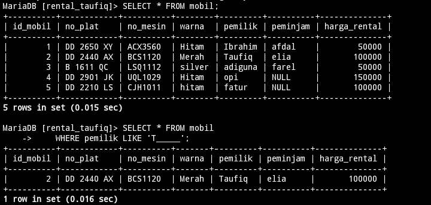

---
# OPERATOR LOGIKA DAN PEMBANDING 

---
## AND

### Struktur Query
```MySQL
SELECT * FROM [nama_tabel]
WHERE [Kondisi 1] AND [Kondisi 2];
```

### Contoh
```MySQL
SELECT * FROM mobil
WHERE warna = "Merah" AND Pemilik ="Taufiq";
```
``
### Hasil


### Analisis
- `SELECT * FROM` : Merupakan query awal untuk menampilkan sebuah tabel yang didalamnya berisikan kolom, di mana kolom tersebut menampung sebuah data.
- `mobil` : nama dari tabel yang ingin kita tampilkan data-data nya.
- `WHERE` :  digunakan untuk menyaring data yang ada pada tabel
- `warna = "Merah" AND Pemilik ="Taufiq";` : terdapat 2 kondisi yang harus di penuhi untuk menampilkan sebuah data. Hanya baris dengan nilai kolom "warna" yang sama dengan "Merah" yang akan dipertimbangkan.di kondisi 2, baris tersebut juga harus memiliki nilai kolom "Pemilik"  sama dengan "Taufiq". Klausa AND memastikan bahwa kedua kondisi harus terpenuhi secara bersamaan agar bisa tampil.

### Kesimpulan
Perintah MySQL tersebut mengambil/manampilkan semua kolom dari tabel di mana warna adalah "Merah" dan pemilik adalah "Taufiq".

---
## OR
### Struktur Query
```MySQL
SELECT * FROM [nama_tabel]
WHERE [Kondisi 1] OR [Kondisi 2];
```

### Contoh
```MySQL
SELECT * FROM mobil
WHERE warna = "Merah" OR Pemilik ="adiguna";
```

### Hasil


### Analisis
- `SELECT * FROM` : Merupakan query awal untuk menampilkan sebuah tabel yang didalamnya berisikan kolom, di mana kolom tersebut menampung sebuah data.
- `mobil` nama dari tabel yang ingin kita tampilkan data-data nya.
- `WHERE` :  digunakan untuk menyaring data yang ada pada tabel
- `WHERE warna = "Merah" OR Pemilik = "adiguna";`: Menetapkan kondisi untuk pengambilan data. dimana jika salah satu Baris yang memenuhi dari dua kondisi ini tersebut akan diambil/ditampilkan.

### Kesimpulan
digunakan untuk mengambil semua kolom dari tabel `mobil` di mana nilai kolom `warna` adalah `Merah` atau nilai kolom `Pemilik` adalah `adiguna`. Hasilnya akan mencakup data yang memenuhi salah satu dari dua kondisi tersebut.

---
## BETWEEN
### Struktur Query
```MySQL
SELECT * FROM [nama_tabel]
WHERE [nama_kolom] BETWEEN [nilai] AND [nilai];

```

### Contoh
```MySQL
SELECT * FROM mobil
WHERE harga_rental BETWEEN 100000 AND 150000;
```

### Hasil


### Analisis
- `SELECT * FROM` : Merupakan query awal untuk menampilkan sebuah tabel yang didalamnya berisikan kolom, di mana kolom tersebut menampung sebuah data.
- `mobil` nama dari tabel yang ingin kita tampilkan data-data nya.
- `WHERE` :  digunakan untuk menyaring data yang ada pada tabel
- `harga_rental BETWEEN 100000 AND 150000;`: dimana query tersebut memerintahkan untuk mengambil data Kolom `harga_rental` dari `100000` Sampai dengan `150000`.

### Kesimpulan 
Perintah MySQL tersebut akan  mengambil data dari tabel "mobil" dengan rentang harga sewa antara 100,000 dan 150,000.

---
## NOT BETWEEN
### Struktur Query
```MySQL
SELECT * FROM [nama_tabel]
WHERE [nama_kolom] NOT BETWEEN [nilai_1] AND [nilai_2];
```

### Contoh
```MySQL
SELECT * FROM mobil
WHERE harga_rental NOT BETWEEN 100000 AND 150000;
```
### Hasil


### Analisis
- `SELECT * FROM` : Merupakan query awal untuk menampilkan sebuah tabel yang didalamnya berisikan kolom, di mana kolom tersebut menampung sebuah data.
- `mobil` nama dari tabel yang ingin kita tampilkan data-data nya.
- `WHERE` :  digunakan untuk menyaring data yang ada pada tabel
- `harga_rental NOT BETWEEN 100000 AND 150000;` :  data yang harga_rental nya diluar dari 100000 sampai dengan 150000 yang akan di ambil

### Kesimpulan
Perintah MySQL tersebut akan mengambil data dari tabel "mobil" di mana harga sewa tidak berada dalam rentang/diluar 100,000 hingga 150,000.

---
## <=
### Struktur Query
```MySQL
SELECT * FROM [nama_tabel]
WHERE [nama_kolom] <= [nilai];
```

### Contoh
```MySQL
SELECT * FROM mobil
WHERE harga_rental <= 100000;
```
### Hasil


### Analisis
- `SELECT * FROM` : Merupakan query awal untuk menampilkan sebuah tabel yang didalamnya berisikan kolom, di mana kolom tersebut menampung sebuah data.
- `mobil` nama dari tabel yang ingin kita tampilkan data-data nya.
- `WHERE` :  digunakan untuk menyaring data yang ada pada tabel
- `harga_rental <= 100000;` : akan menampilkan sebuah data yang hanya memiliki nilai harga_rental kurang dari `100000` atau sama dengan.

### Kesimpulan 
Perintah MySQL tersebut akan menampilkan sebuah data tabel mobil dimana harga_rentalnya berada di bawah dari `100000` atau sama dengan.

---
## >=

### Struktur Query
```MySQL
SELECT * FROM [nama_tabel]
WHERE [nama_kolom] >= [nilai];
```
### Contoh
```MySQL
SELECT * FROM mobil
WHERE harga_rental >= 100000;
```
### Hasil


### Analisis
- `SELECT * FROM` : Merupakan query awal untuk menampilkan sebuah tabel yang didalamnya berisikan kolom, di mana kolom tersebut menampung sebuah data.
- `mobil` nama dari tabel yang ingin kita tampilkan data-data nya.
- `WHERE` :  digunakan untuk menyaring data yang ada pada tabel
- `harga_rental >= 100000;` : akan menampilkan sebuah data dari kolom harga_rental yang bernilai lebih besar dari `100000` atau sama dengan.

### Kesimpulan
Perintah MySQL tersebut akan menampilkan sebuah data tabel mobil dimana harga_rentalnya berada di atas `100000` atau sama dengan.

---
## <> atau =!
### Struktur Query
```MySQL
SELECT * FROM [nama_tabel]
WHERE [nama_kolom] <> [nilai];
```

### Contoh
```MySQL
SELECT * FROM mobil
WHERE harga_rental <> 100000;
```

### Hasil


### Analisis 
- `SELECT * FROM` : Merupakan query awal untuk menampilkan sebuah tabel yang didalamnya berisikan kolom, di mana kolom tersebut menampung sebuah data.
- `mobil` nama dari tabel yang ingin kita tampilkan data-data nya.
- `WHERE` :  digunakan untuk menyaring data yang ada pada tabel
- `harga_rental <> 100000;` : akan menampilkan sebuah data pada kolom `harga_rental` yang bukan `100000` nilainya

### Kesimpulan 
mengambil semua data dari tabel "mobil" kecuali  harga rental tidak sama dengan 100000. 


---
# TANTANGAN

---
## Struktur
```MySQL 
SELECT [nama_kolom] FROM [nama_tabel]
WHERE [nama_kolom] = [nilai];
```
## Contoh 
```MySQL
SELECT pemilik FROM mobil
WHERE id_mobil = 1;
```
## Hasil 


## Analisis 
- `SELECT` : digunakan untuk mengambil sebuah data pada tabel
- `pemilik` : nama dari kolom yang akan kita tampilkan
- `FROM mobil` :  merupakan nama tabel yang ingin kita ambil datanya
- `WHERE` :  digunakan untuk menyaring data yang ada pada tabel
- `id_mobil = 1;` merupakan baris yang akan kita tampilkan yang memiliki id_mobil bernilai 1

## Kesimpulan
perintah SQL tersebut adalah mengambil/menampilkan pemilik mobil dengan ID 1 dari tabel "mobil".

---
# IN

---
## IN
### Struktur Query
```MySQL

SELECT * FROM [nama_tabel] WHERE [nama_kolom] IN('nilai1','nilai2');

```

### Contoh 
```MySQL
SELECT * FROM mobil WHERE warna IN('Hitam','Merah');
```

### Hasil


### Analisis
- `SELECT * FROM` : Merupakan query awal untuk menampilkan sebuah tabel yang didalamnya berisikan kolom, di mana kolom tersebut menampung sebuah data.
- `mobil` nama dari tabel yang ingin kita tampilkan data-data nya.
- `WHERE` :  digunakan untuk menyaring data yang ada pada tabel.
- `warna IN('Hitam','Merah');` : Query tersebut menampilkan sebuah data pada tabel dimana kolom warna yang bernilai Hitam dan Merah akan di tampilkan.

### Kesimpulan 
Perintah MySQL tersebut Menyaring sebuah data pada tabel mobil dimana akan hanya menampilkan warna Hitam dan Merah.

---
## IN & AND
### Struktur Query
```MySQL

SELECT * FROM [nama_tabel]
 WHERE [nama_kolom] IN ('nilai')
 AND [nama_kolom] = nilai;

```

### Contoh
```MySQL
SELECT * FROM mobil
     WHERE warna IN('Merah','silver')
     AND harga_rental = 50000;
```

### Hasil


### Analisis
- `SELECT * FROM` : Merupakan query awal untuk menampilkan sebuah tabel yang didalamnya berisikan kolom, di mana kolom tersebut menampung sebuah data.
- `mobil` nama dari tabel yang ingin kita tampilkan data-data nya.
- `WHERE` :  digunakan untuk menyaring data yang ada pada tabel.
- ` warna IN('Merah','silver') AND harga_rental = 50000;` : Query tersebut mencari dimana kolom warna yang hanya memiliki nilai Merah atau silver, dan kolom harga_rental bernilai 50000 yang akan tampil.
### Kesimpulan
Menggunakan operator AND, memastikan bahwa kedua kondisi/kolom harus benar untuk memilih baris yang akan diambil.

---
## IN & OR
### Struktur Query
```MySQL
SELECT * FROM [nama_tabel]
    WHERE [nama_kolom] IN ('nilai')
    OR [nama_kolom] = nilai;
```

### Contoh
```MySQL
SELECT * FROM mobil
     WHERE warna IN('Merah','silver')
     OR harga_rental = 150000;
```

### Hasil


### Analisis
- `SELECT * FROM` : Merupakan query awal untuk menampilkan sebuah tabel yang didalamnya berisikan kolom, di mana kolom tersebut menampung sebuah data.
- `mobil` nama dari tabel yang ingin kita tampilkan   data-data nya.
- `WHERE` :  digunakan untuk menyaring data yang ada pada tabel.
- ` warna IN('Merah','silver') OR harga_rental = 150000;` : query tersebut mencari data pada kolom warna bernilai Merah dan silver atau kolom harga_rental yang bernilai 150000 yang akan ditampilkan.

### Kesimpulan
Menggunakan operator logika OR memastikan bahwa salah satu dari 2 kondisi/kolom tersebut memenuhi syarat akan diambil.

---
## IN + AND + OPERATOR 

---
### LEBIH BESAR 

#### Struktur Query
```MySQL
SELECT * FROM [nama_tabel]
     WHERE [nama_kolom] IN ('nilai1','nilai2')
     AND [nama_kolom] > nilai;
```

#### Contoh
```MySQL
SELECT * FROM mobil
     WHERE warna IN('Merah','silver')
     AND harga_rental > 50000;
```

#### Hasil


#### Analisis
- `SELECT * FROM` : Merupakan query awal untuk menampilkan sebuah tabel yang didalamnya berisikan kolom, di mana kolom tersebut menampung sebuah data.
- `mobil` nama dari tabel yang ingin kita tampilkan   data-data nya.
- `WHERE` :  digunakan untuk menyaring data yang ada pada tabel.
- `warna IN('Merah','silver') AND harga_rental > 50000;`: query tersebut mencari data pada kolom  warna yang bernilai Merah atau silver dengan kriteria harga_rental berada di atas 50000.

#### Kesimpulan
Query tersebut mencari data pada kolom warna yang bernilai Merah atau silver dan pada saat yang sama kolom harga_rental harus lebih besar dari 50000.

---
### LEBIH KECIL
#### Struktur Query
```MySQL
SELECT * FROM [nama_tabel]
     WHERE [nama_kolom] IN ('nilai1','nilai2')
     AND [nama_kolom] > nilai;
```

#### Contoh
```MySQL
SELECT * FROM mobil
     WHERE warna IN('Merah','silver')
     AND harga_rental < 1000000;
```

#### Hasil


#### Analisis
- `SELECT * FROM` : Merupakan query awal untuk menampilkan sebuah tabel yang didalamnya berisikan kolom, di mana kolom tersebut menampung sebuah data.
- `mobil` nama dari tabel yang ingin kita tampilkan   data-data nya.
- `WHERE` :  digunakan untuk menyaring data yang ada pada tabel.
- `warna IN('Merah','silver') AND harga_rental < 50000;`: query tersebut mencari data pada kolom  warna yang bernilai Merah atau silver dengan kriteria harga_rental berada dibawah 100000.

#### Kesimpulan
Query tersebut mencari data pada kolom warna yang bernilai Merah atau silver dan pada saat yang sama kolom harga_rental berada dibawah 100000.

---
# LIKE

---
## MENCARI AWALAN
### Struktur Query
```MySQL
SELECT * FROM [nama_tabel]
     WHERE [nama_kolom] LIKE 'nilai%';
```

### Contoh
```MySQL
SELECT * FROM mobil
     WHERE pemilik LIKE 'T%';
```

### Hasil


### Analisis
- `SELECT * FROM` : Merupakan query awal untuk menampilkan sebuah tabel yang didalamnya berisikan kolom, di mana kolom tersebut menampung sebuah data.
- `mobil` nama dari tabel yang ingin kita tampilkan   data-data nya.
- `WHERE` :  digunakan untuk menyaring data yang ada pada tabel.
- `pemilik LIKE 'T%';` : query tersebut mencari data pada kolom pemilik yang berawalan kata huruf T akan diambil.
### Kesimpulan
`SELECT * FROM mobil WHERE pemilik LIKE 'T%';`
: Query tersebut mencari data pada tabel mobil yang memiliki awalan kata huruf T pada kolom pemilik.

---
## MENCARI AKHIRAN
### Struktur Query
```MySQL
SELECT * FROM [nama_tabel]
     WHERE [nama_kolom] LIKE 'nilai%';
```

### Contoh
```MySQL
SELECT * FROM mobil
     WHERE pemilik LIKE '%a';
```

### Hasil


### Analisis
- `SELECT * FROM` : Merupakan query awal untuk menampilkan sebuah tabel yang didalamnya berisikan kolom, di mana kolom tersebut menampung sebuah data.
- `mobil` nama dari tabel yang ingin kita tampilkan   data-data nya.
- `WHERE` :  digunakan untuk menyaring data yang ada pada tabel.
- `pemilik LIKE '%a';` : Query tersebut mencari data pada kolom pemilik yang akhiran katanya adalah huruf a yang akan diambil 
### Kesimpulan
`SELECT * FROM mobil WHERE pemilik LIKE '%a';`
: Perintah query tersebut akan menampilkan sebuah data pada tabel mobil dimana kolom pemilik akhiran katanya huruf a.

---
## MENCARI AWALAN & AKHIRAN
### Struktur Query
```MySQL
SELECT * FROM [nama_tabel]
   WHERE [nama_kolom] LIKE                            'nilai_awal%nilai_akhir';
```

### Contoh
```MySQL
SELECT * FROM mobil
   WHERE pemilik LIKE 'T%q';
```

### Hasil


### Analisis
- `SELECT * FROM` : Merupakan query awal untuk menampilkan sebuah tabel yang didalamnya berisikan kolom, di mana kolom tersebut menampung sebuah data.
- `mobil` nama dari tabel yang ingin kita tampilkan   data-data nya.
- `WHERE` :  digunakan untuk menyaring data yang ada pada tabel.
- `pemilik LIKE 'T%q';` : Perintah query tersebut akan menampilkan sebuah data pada kolom pemilik yang berawalan huruf T dan akhiran katanya q.
### Kesimpulan
`SELECT * FROM mobil WHERE pemilik LIKE 'T%q';`
: Perintah query tersebut mencari data pada tabel dimana kolom pemilik yang awalan katanya huruf T dan akhiran katanya q yang akan diambil.

---
## MENCARI BERDASARKAN TOTAL KARAKTER 

### Struktur Query 
``` MySQL
SELECT * FROM [nama_tabel]
   WHERE [nama_kolom] LIKE 'Nilai__';

SELECT * FROM [nama_tabel]
   WHERE [nama_kolom] LIKE 'underscore';
```

### Contoh
```MySQL
SELECT * FROM mobil
    WHERE pemilik LIKE 'T_____';

SELECT * FROM mobil
     WHERE warna LIKE '_____';
```

### Hasil



### Analisis
- `SELECT * FROM` : Merupakan query awal untuk menampilkan sebuah tabel yang didalamnya berisikan kolom, di mana kolom tersebut menampung sebuah data.
- `mobil` nama dari tabel yang ingin kita tampilkan   data-data nya.
- `WHERE` :  digunakan untuk menyaring data yang ada pada tabel.
- `pemilik LIKE 'T_____';` : perintah query ini akan mencari data dimana kolom pemilik memiliki awalan kata huruf T serta panjang karakternya sebanyak 6.
- `warna LIKE '_____';` : perintah ini mencari data, dimana kolom warna yang memiliki jumlah karakter sebanyak 6 yang akan diambil.

### Kesimpulan
- `SELECT * FROM mobil WHERE pemilik LIKE 'T_____';` : perintah query tersebut akan mencari data pada tabel mobil, dimana kolom pemilik memiliki awalan kata T dan jumlah karakter sebanyak 6 yang akan diambil.
- `SELECT * FROM mobil WHERE warna LIKE '_____';` : dan kalau perintah query ini akan mencari data pada tabel mobil, dimana kolom warna memiliki jumlah karakter sebanyak 6 maka akan diambil.

---
## KOMBINASI
```MySQL
SELECT * FROM [nama_tabel]
    WHERE [nama_kolom] LIKE 'nilai%'

SELECT * FROM [nama_tabel]
    WHERE [nama_kolom] LIKE 'nilai%';

```

### Contoh
```MySQL
SELECT * FROM mobil
    WHERE pemilik LIKE '_d%';

SELECT * FROM mobil
    WHERE pemilik LIKE '__i%';
```
### Hasil


### Analisis
- `SELECT * FROM` : Merupakan query awal untuk menampilkan sebuah tabel yang didalamnya berisikan kolom, di mana kolom tersebut menampung sebuah data.
- `mobil` nama dari tabel yang ingin kita tampilkan   data-data nya.
- `WHERE` :  digunakan untuk menyaring data yang ada pada tabel.
- `pemilik LIKE '_d%';` : perintah ini akan mencari data pada kolom pemilik, dimana underscore nya sebagai pengganti karakter awal dan karakter keduanya bernilai d.
- `pemilik LIKE '__i%';` perintah ini akan mencari data pada kolom pemilik, yang dimana 2 underscore nya sebagai pengganti nilai asli dan karakter ketiganya bernilai i.
### Kesimpulan
- `SELECT * FROM mobil WHERE pemilik LIKE '_d%';` : Perintah query tersebut akan mencari data pada tabel mobil, dimana kolom pemilik yang bernilai d pada karakter keduanya akan diambil.
- `SELECT * FROM mobil WHERE pemilik LIKE '__i%';` : Perintah query tersebut akan mencari data pada tabel mobil, dimana kolom pemilik yang bernilai i pada karakter ketiga yang akan diambil.

---
## NOT LIKE
### Struktur Query 
```MySQL

SELECT * FROM [nama_tabel]
    WHERE [nama_kolom] NOT LIKE 'nilai%';
```

### Contoh
```MySQL
SELECT * FROM mobil
    WHERE pemilik NOT LIKE 'opi%';
```

### Hasil


### Analisis
- `SELECT * FROM` : Merupakan query awal untuk menampilkan sebuah tabel yang didalamnya berisikan kolom, di mana kolom tersebut menampung sebuah data.
- `mobil` nama dari tabel yang ingin kita tampilkan   data-data nya.
- `WHERE` :  digunakan untuk menyaring data yang ada pada tabel.
- `pemilik NOT LIKE 'opi%';` : Perintah query ini tidak akan menampilkan yang bernilai Opi pada kolom pemilik
### Kesimpulan
`SELECT * FROM mobil WHERE pemilik NOT LIKE 'opi%';`: Jadi Perintah tersebut mengecualikan            sebuah data pada tabel mobil dimana kolom pemilik     yang bernilai Opi tidak akan ditampilkan.

---
