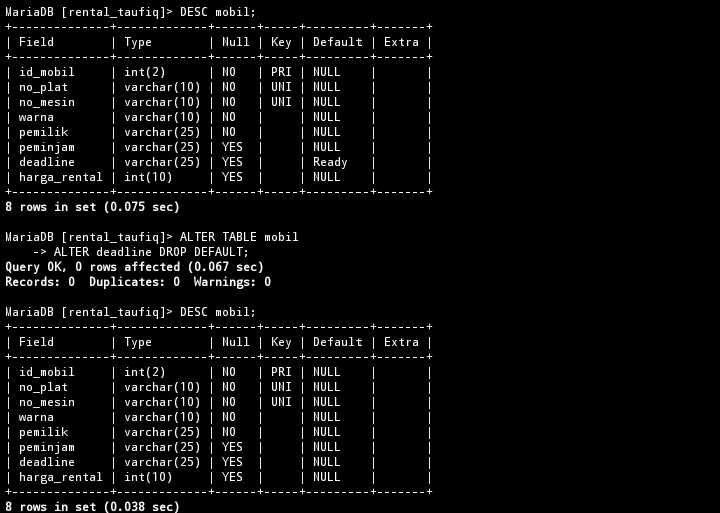
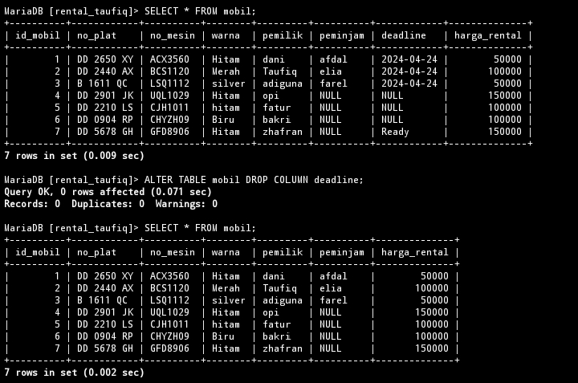
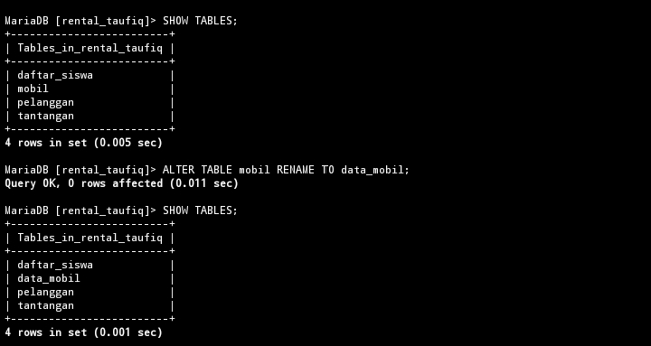

# Struktur Awal Tabel


---
# Menambahkan Kolom
## Struktur Query 
```mysql
ALTER TABLE [nama_tabel] 
  ADD [nama_kolom_baru] [type_data] 
  [posisi_dalam_tabel];
```
## Contoh 
```MySQL
ALTER TABLE mobil 
  ADD batas_peminjaman varchar(10) AFTER         peminjam;
```
## Hasil

## Analisis 
- `ALTER TABLE` digunakan untuk mengubah struktur tabel yang sudah ada.
- `mobil` merupakan nama dari tabel yang ingin di ubah struktur nya.
- `ADD batas_peminjam VARCHAR(10)` query tersebut ingin menambahkan kolom baru dengan nama `batas_peminjam` dan type data `VARCHAR`  dengan maksimal nilainya `(10)`.
- `AFTER peminjam` kolom baru yang ditambahkan akan berada disamping kanan kolom `peminjam`.
## Kesimpulan 
Perintah tersebut akan menambahkan kolom baru pada tabel mobil dengan nama `batas_peminjam`.

## Tambahan 
### Penjelasan 
kolom yang baru kita tambahkan pada tabel mobil, kita berikan data di dalamnya yang memiliki `peminjam`.
### Struktur Query
```mysql
UPDATE mobil 
SET batas_peminjam = "2024-04-24" WHERE peminjam is NOT NULL;
```
### Hasil


---
# Mengubah Nama Kolom
## Struktur Query 
```mysql
ALTER TABLE [nama_tabel]
    RENAME COLUMN [nama_kolom_sebelumnya] TO       [nama_kolom_baru];
```
## Contoh
```mysql
ALTER TABLE mobil
    RENAME COLUMN batas_peminjaman TO             deadline;
```
## Hasil

## Analisis 
- `ALTER TABLE` digunakan untuk mengubah struktur tabel yang sudah ada.
- `mobil` merupakan nama dari tabel yang ingin di ubah struktur nya..
- `RENAME COLUMN` merupakan query yang di gunakan untuk mengganti nama kolom dalam tabel.
- `batas_peminjam` nama kolom yang akan diubah.
- `TO deadline` nama baru yang akan diberikan kepada kolom tersebut setelah diubah.

## Kesimpulan 
Perintah tersebut akan mengubah nama kolom `batas_peminjam` menjadi `deadline` dalam tabel mobil.

---
# Mengubah Tipe data kolom
## Struktur Query 
```mysql

ALTER TABLE [nama_tabel] MODIFY [nama_kolom] [tipe_data];
```

## Contoh
```mysql
ALTER TABLE mobil MODIFY deadline DATE;
```
## Hasil


## Analisis 
- `ALTER TABLE` digunakan untuk mengubah struktur tabel yang sudah ada.
- `mobil` merupakan nama dari tabel yang ingin di ubah struktur nya.
- `MODIFY` digunakan untuk mengubah definisi kolom yang sudah ada dalam tabel.
- `deadline DATE` menyatakan bahwa kolom `deadline` akan diubah agar memiliki tipe data `DATE`.

## Kesimpulan 
Perintah tersebut mengganti type data pada kolom deadline menjadi `DATE`.

---
# Menambahkan Constraint
## Struktur Query 
```mysql
ALTER TABLE [nama_tabel]
    ALTER [nama_kolom] SET DEFAULT 'nilai';
```
## Contoh
```mysql
ALTER TABLE mobil
    ALTER deadline SET DEFAULT 'Ready';
```
## Hasil

## Analisis 
- `ALTER TABLE` digunakan untuk mengubah struktur tabel yang sudah ada.
- `mobil` merupakan nama dari tabel yang ingin di ubah struktur nya.
- `ALTER deadline` Menunjukkan kolom `deadline` yang akan diubah.
- `SET DEFAULT 'Ready'` Menetapkan nilai default baru untuk kolom deadline, dalam hal ini `Ready`.

## Kesimpulan 
digunakan untuk menetapkan nilai default `Ready`
untuk kolom deadline dalam tabel `mobil`. Ini memastikan bahwa jika baris baru ditambahkan tanpa nilai untuk `deadline`, kolom tersebut akan diisi secara otomatis dengan nilai `Ready`.

## Tambahan 
### Penjelasan 
Menambahkan 1 baris data baru pada tabel mobil kecuali pada kolom deadline.
### Struktur Query 
```mysql
INSERT INTO mobil
(id_mobil,no_plat,no_mesin,warna,pemilik,
 peminjam,harga_rental)
VALUES (7,"DD 5678 GH","GFD8906","Hitam",
"zhafran",NULL,150000);
```
### Hasil

## Referensi 
https://revou.co/panduan-teknis/sql-constraint

---
# Menghapus Constraint 
## Struktur Query 
```mysql
ALTER TABLE [nama_tabel]
    ALTER [nama_kolom] DROP DEFAULT;
```
## Contoh 
```mysql
ALTER TABLE mobil
    ALTER deadline DROP DEFAULT;
```
## Hasil

## Analisis 
- `ALTER TABLE` digunakan untuk mengubah struktur tabel yang sudah ada.
- `mobil` merupakan nama dari tabel yang ingin di ubah struktur nya.
- `ALTER deadline` Menunjukkan kolom `deadline` yang akan diubah.
- `DROP DEFAULT` Menyatakan bahwa nilai default yang sudah ditetapkan untuk kolom `deadline` akan dihapus.
## Kesimpulan 
perintah ini akan menghapus nilai default (jika ada) dari kolom `deadline` dalam tabel `mobil`. 

## Referensi 
https://www.geeksforgeeks.org/sql-drop-constraint/

---
# Menghapus Kolom
## Struktur Query 
```mysql
ALTER TABLE [nama_tabel] DROP COLUMN [nama_kolom]
```
## Contoh 
```mysql
ALTER TABLE mobil DROP COLUMN deadline;
```
## Hasil

## Analisis 
- `ALTER TABLE` digunakan untuk mengubah struktur tabel yang sudah ada.
- `mobil` merupakan nama dari tabel yang ingin di ubah struktur nya.
- `DROP COLUMN` Menunjukkan bahwa operasi yang dilakukan adalah penghapusan kolom.
- `deadline` Merupakan nama kolom yang akan dihapus dari tabel.
## Kesimpulan 
digunakan untuk menghapus kolom `deadline` dari tabel `mobil`. 

---
# Mengganti Nama Tabel
## Struktur Query
```mysql
ALTER TABLE [nama_tabel] RENAME TO [nama_tabel_terbaru];
```
## Contoh 
```mysql
ALTER TABLE mobil RENAME TO data_mobil;
```

## Hasil

## Analisis 
- `ALTER TABLE` digunakan untuk mengubah struktur tabel yang sudah ada.
- `mobil` merupakan nama dari tabel yang ingin di ubah struktur nya.
- `RENAME TO` Menunjukkan bahwa yang dilakukan adalah pengubahan nama tabel.
- `data_mobil` nama baru yang akan di berikan pada tabel.
## Kesimpulan 
perintah ini akan mengubah nama tabel `mobil` menjadi `data_mobil`. 

---

# Referensi pembahasan ALTER

https://www.techonthenet.com/mysql/tables/alter_table.php