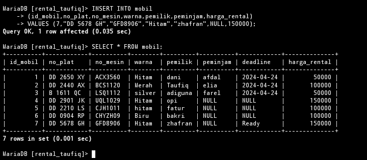

# Struktur Awal Tabel


---
# Menambahkan Kolom
## Struktur Query 
```mysql

ALTER TABLE [nama_tabel] ADD [nama_kolom_baru]
[type_data] [posisi_dalam_tabel] [nama_kolom]
```
## Contoh 
```MySQL
ALTER TABLE mobil ADD batas_peminjaman varchar(10) AFTER peminjam;
```
## Hasil

## Analisis 
## Kesimpulan 

## Tambahan 
### Struktur Query


### Penjelasan 

---
# Mengubah Nama Kolom
## Struktur Query 
```mysql
ALTER TABLE [nama_tabel]
  RENAME COLUMN [nama_kolom_sebelumnya] TO       [nama_kolom_baru];
```
## Contoh
```mysql
ALTER TABLE mobil
 RENAME COLUMN batas_peminjaman TO deadline;
```
## Hasil

## Analisis 
## Kesimpulan 

---
# Mengubah Tipe data kolom
## Struktur Query 
```mysql

ALTER TABLE [nama_tabel] MODIFY [nama_kolom] [tipe_data];
```

## Contoh
```mysql
ALTER TABLE mobil MODIFY deadline DATE;
```
## Hasil

## Analisis 
## Kesimpulan 

---
# Menambahkan Constraint
## Struktur Query 
## Contoh
```mysql
ALTER TABLE mobil
  ALTER deadline
```
## Hasil

## Analisis 
## Kesimpulan 

## Tambahan 
### Struktur Query 
```mysql
INSERT INTO mobil
(id_mobil,no_plat,no_mesin,warna,pemilik,
 peminjam,harga_rental)
VALUES (7,"DD 5678 GH","GFD8906","Hitam",
"zhafran",NULL,150000);
```
### Hasil

## Referensi 
https://revou.co/panduan-teknis/sql-constraint

---
# Menghapus Constraint 
## Struktur Query 
## Contoh 
## Hasil
## Analisis 
## Kesimpulan 

## Referensi 
https://www.geeksforgeeks.org/sql-drop-constraint/


---

## Struktur Query 
## Contoh 
## Hasil
## Analisis 
## Kesimpulan 

---

## Struktur Query 
## Contoh 
## Hasil
## Analisis 
## Kesimpulan 