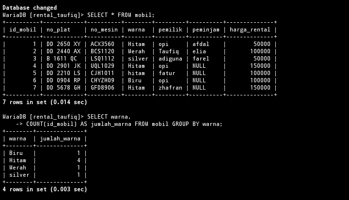
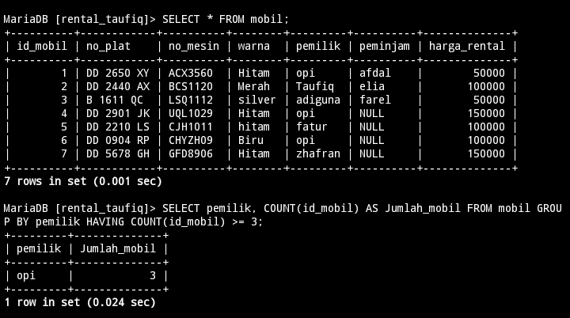
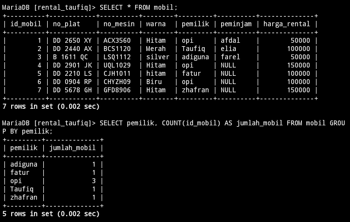
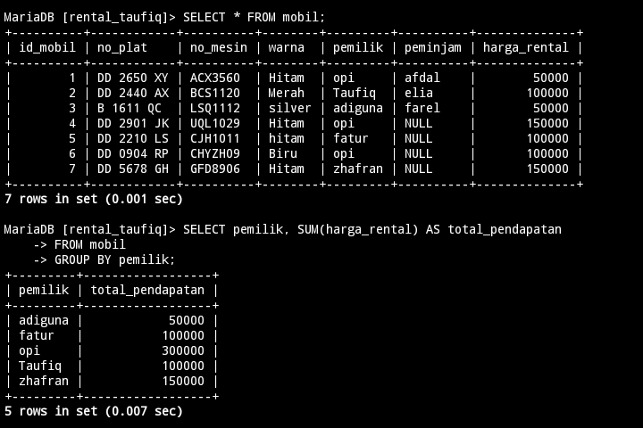
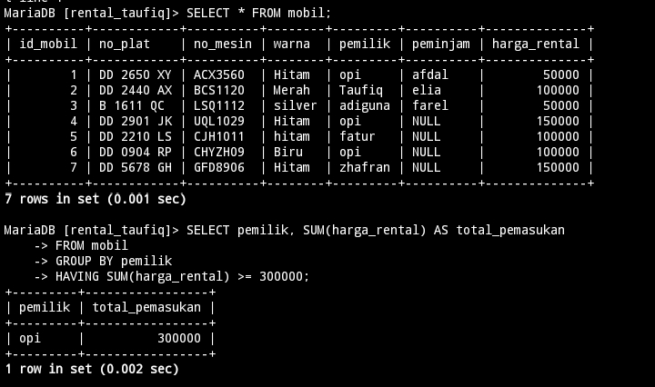
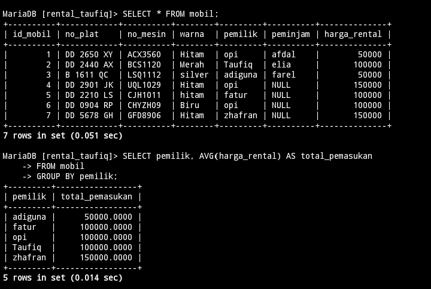
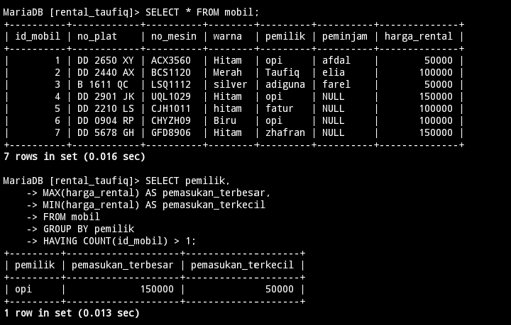

# Tampilkan jumlah data mobil dan kelompokkan berdasarkan warna nya sesuai dengan tabel mobil kalian
## Struktur Query 
```mysql
SELECT [nama_kolom],
COUNT([nama_kolom]) AS [nama_alias] 
FROM [nama_tabel] GROUP BY [nama_kolom]
```
## Contoh 
```mysql
SELECT warna,
COUNT(id_mobil) AS jumlah_warna 
FROM mobil GROUP BY warna;
```
## Hasil


## Analisis 
- `SELECT warna` menampilkan warna-warna yang ada pada tabel mobil.
- `COUNT(id_mobil)` `COUNT` digunakan untuk menghitung jumlah baris `id_mobil` yang ada pada tabel mobil.
- `AS jumlah_warna` digunakan sebagai nama kolom sementara untuk hasil perhitungan.
- `FROM mobil` data yang akan di tampilkan berasal dari tabel `mobil`.
- `GROUP BY warna` mengelompokkan baris yang memiliki nilai warna yang sama. Dengan kata lain, mobil-mobil yang memiliki warna yang sama akan dikelompokkan bersama.

## Kesimpulan 
Query ini sangat berguna untuk menganalisis distribusi jumlah mobil berdasarkan warna dalam tabel `mobil`. Dengan menggunakan `GROUP BY warna`, 

---
# Berdasarkan query ini tampilkan yang lebih besar dari 3 atau sama dengan 3 pemilik mobil nya
## Struktur Query 
```mysql
SELECT [nama_kolom],
COUNT[(nama_kolom)] AS [nama_alias] 
FROM [nama_tabel] GROUP BY [nama_kolom] 
HAVING COUNT([nama_kolom]) >= nilai;
```
## Contoh 
```mysql
SELECT pemilik, 
COUNT(id_mobil) AS Jumlah_mobil 
FROM mobil GROUP BY pemilik 
HAVING COUNT(id_mobil) >= 3;
```
## Hasil

## Analisis 
- `SELECT pemilik` Memilih kolom `pemilik` untuk menampilkan nama pemilik mobil.
- `COUNT(id_mobil) AS Jumlah_mobil` Menghitung jumlah mobil (`id_mobil`) yang dimiliki oleh setiap pemilik dan memberikan hasil perhitungan ini alias `Jumlah_mobil`.
- `FROM mobil` data yang akan di tampilkan berasal dari tabel `mobil`.
- `GROUP BY pemilik` Mengelompokkan baris data berdasarkan nilai yang unik di kolom `pemilik`.
- `HAVING COUNT(id_mobil) >= 3`   Menggunakan klausa HAVING untuk memfilter grup yang telah dibuat oleh GROUP BY. Klausa ini memastikan hanya grup yang memiliki jumlah mobil  tiga atau lebih yang disertakan dalam hasil akhir.
## Kesimpulan 
Query ini berguna untuk menganalisis data kepemilikan mobil dengan mengidentifikasi pemilik yang memiliki jumlah mobil yang signifikan (tiga atau lebih).

---
# Tampilkan semua pemilik dengan jumlah mobilnya yang memiliki atau sama dengan 3 mobil
## Struktur Query 
```mysql
SELECT [nama_kolom],
COUNT[(nama_kolom)] AS [nama_alias] 
FROM [nama_tabel] GROUP BY [nama_kolom];
```
## Contoh 
```mysql
SELECT pemilik, 
COUNT(id_mobil) AS jumlah_mobil 
FROM mobil GROUP BY pemilik;
```
## Hasil

## Analisis 
- `SELECT pemilik` digunakan untuk menampilkan nama pemilik mobil.
- `COUNT(id_mobil) AS jumlah_mobil` digunakan untuk menjumlahkan berapa baris `id_mobil`, dengan memberikan nama alias `jumlah_mobil`.
- `FROM mobil` data yang di ambil berasal dari tabel `mobil`.
- `GROUP BY pemilik` mengelompokkan baris data berdasarkan nilai yang unik dikolom `pemilik`.

## Kesimpulan 
Query ini sangat berguna untuk melakukan agregasi data berdasarkan pemilik dan menghitung jumlah entitas (mobil) yang dimiliki oleh setiap entitas (pemilik).

---
# Berdasarkan query yang ada pada praktikum 5 bagian 7 tampilkan data pada table mobil dengan mengelompokan berdasarkan pemiliknya.hitung menggunakan sum total pendapatan pemilik berdasarkan harga rental

## Struktur Query 
```mysql
SELECT [nama_kolom],
SUM[(nama_kolom)] AS [nama_alias] 
FROM [nama_tabel] GROUP BY [nama_kolom];
```
## Contoh 
```Mysql
SELECT pemilik,
SUM(harga_rental) AS total_pendapatan
FROM mobil GROUP BY pemilik;
```
## Hasil

## Analisis 
- `SELECT pemilik` digunakan untuk menampilkan nama pemilik mobil.
- `SUM(harga_rental) AS total_pendapatan` digunakan untuk menghitung total pendapatan pemilik dari `harga_rental` , dengan memberikan nama alias `total_pendapatan`.
- `FROM mobil` data yang di ambil berasal dari tabel `mobil`.
- `GROUP BY pemilik` mengelompokkan baris data berdasarkan nilai yang unik dikolom `pemilik`.
## Kesimpulan 
Query ini sangat berguna untuk melakukan agregasi data berdasarkan pemilik dan menghitung total pendapatan dari harga rental mobil yang diperoleh oleh setiap pemilik.

---
# Berdasarkan praktikum 5 query no 8 tampilkan jumlah pemasukan pemilik berdasarkan harga rental kelompokkan berdasarkan pemiliknya dan seleksi yang total pemasukannya atau harga rentalnya mencapai lebih besar atau sama dengan 300k

## Struktur Query 
```mysql
SELECT [nama_kolom],
SUM[(nama_kolom)] AS [nama_alias] FROM [nama_tabel] GROUP BY [nama_kolom] 
HAVING SUM([nama_kolom]) >= nilai;
```
## Contoh 
```Mysql
SELECT pemilik,
SUM(harga_rental) AS total_pemasukan
FROM mobil GROUP BY pemilik
HAVING SUM(harga_rental) >= 300000;
```
## Hasil

## Analisis 
- `SELECT pemilik` digunakan untuk menampilkan nama pemilik mobil.
- `SUM(harga_rental) AS total_pendapatan` digunakan untuk menghitung total pendapatan pemilik dari `harga_rental` , dengan memberikan nama alias `total_pendapatan`.
- `FROM mobil` data yang di ambil berasal dari tabel `mobil`.
- `GROUP BY pemilik` mengelompokkan baris data berdasarkan nilai yang unik dikolom `pemilik`.
- `HAVING SUM(harga_rental) >= 300000;` Menggunakan klausa `HAVING` untuk mengfilter grup yang telah dibuat `GROUP BY` data yang akan ditampil hanya total_pemasukan nya diatas `300000`atau sama dengan.
## Kesimpulan 
Query ini sangat berguna untuk melakukan agregasi data berdasarkan pemilik dan menghitung total pendapatan dari harga rental mobil yang diperoleh oleh setiap pemilik, kemudian menyaring hanya pemilik yang memiliki pendapatan minimal 300,000.

---
# Berdasarkan praktikum 6 no 12 tampilkan rata rata pemasukan pemilik mobil kelompokkan berdasarkan pemiliknya

## Struktur Query 
```mysql
SELECT [nama_kolom],
AVG[(nama_kolom)] AS [nama_alias] 
FROM [nama_tabel] GROUP BY [nama_kolom];
```
## Contoh 
```Mysql
SELECT pemilik,
AVG(harga_rental) AS total_pemasukan
FROM mobil GROUP BY pemilik;
```
## Hasil

## Analisis 
- `SELECT pemilik` digunakan untuk menampilkan nama pemilik mobil.
- `AVG(harga_rental) AS total_pemasukan` digunakan untuk menghitung rata-rata pendapatan pemilik dari `harga_rental` , dengan memberikan nama alias `total_pemasukan`.
- `FROM mobil` data yang di ambil berasal dari tabel `mobil`.
- `GROUP BY pemilik` mengelompokkan baris data berdasarkan nilai yang unik dikolom `pemilik`.
## Kesimpulan 
Query ini sangat berguna untuk melakukan agregasi data berdasarkan pemilik dan menghitung rata-rata harga rental mobil yang diperoleh oleh setiap pemilik. 

---
# Berdasarkan praktikum 5 no 16 tampilkan pemasukan  terbesar dan pemasukan terkecil kelompokkan berdasarkan pemiliknya dan seleksi data pemilik yg tampil atau memiliki jumlah mobil lebih besar dari 1

## Struktur Query 
```mysql
SELECT [nama_kolom],
MAX[(nama_kolom)] AS [nama_alias],
MIN[(nama_kolom)] AS [nama_alias]
FROM [nama_tabel] GROUP BY [nama_kolom]
HAVING SUM([nama_kolom]) >= nilai;
```

## Contoh 
```Mysql
SELECT pemilik, 
MAX(harga_rental) AS pemasukan_terbesar, 
MIN(harga_rental) AS pemasukan_terkecil
FROM mobil GROUP BY pemilik
HAVING COUNT(id_mobil) > 1;
```
## Hasil


## Analisis 
- `SELECT pemilik` digunakan untuk menampilkan nama pemilik mobil.
- `MAX(harga_rental) AS pemasukan_terbesar,` digunakan untuk menghitung  pemasukan terbesar dari setiap `pemilik`.
- `MIN(harga_rental) AS pemasukan_terkecil` digunakan untuk menghitung pemasukan terkecil dari setiap `pemilik`.
- `FROM mobil` data yang di ambil berasal dari tabel `mobil`.
- `GROUP BY pemilik` mengelompokkan baris data berdasarkan nilai yang unik dikolom `pemilik`.
-  `HAVING COUNT(id_mobil) > 1;` Menggunakan klausa HAVING untuk memfilter grup yang telah dibuat oleh GROUP BY. Klausa ini memastikan hanya grup yang memiliki lebih dari satu mobil (COUNT(id_mobil) > 1) yang disertakan dalam hasil akhir.
## Kesimpulan 
Query ini sangat berguna untuk melakukan analisis agregasi berdasarkan pemilik dan menghitung nilai maksimum dan minimum dari harga rental yang diperoleh oleh setiap pemilik yang memiliki lebih dari satu mobil. 

---