# Langkah - Langkah Penggunaan apache (web server)

1. *Instalasi Apache*:
    - Unduh paket instalasi Apache dari situs web resminya atau gunakan package manager jika Anda menggunakan sistem operasi Linux. Untuk Windows, Anda dapat menggunakan installer yang disediakan.
2. *Konfigurasi Apache*:
    - Setelah instalasi selesai, Anda perlu melakukan beberapa konfigurasi dasar, seperti menentukan direktori root web, mengatur virtual host jika Anda memiliki beberapa situs, dan mengonfigurasi modul Apache sesuai kebutuhan.
3. *Memulai Server*:
    - Setelah konfigurasi selesai, Anda bisa memulai Apache. Di Linux, Anda bisa menggunakan perintah seperti sudo systemctl start apache2 untuk Debian/Ubuntu, atau sudo systemctl start httpd untuk CentOS/RHEL. Di Windows, Anda bisa memulai Apache melalui layanan "Services" atau dengan menjalankan perintah httpd -k start dari command prompt.
4. *Tes Koneksi*:
    - Buka browser web dan akses http://localhost atau http://127.0.0.1. Jika instalasi berhasil, Anda akan melihat halaman selamat datang dari Apache.
5. *Menyimpan File Situs Web*:
    - Letakkan file-file situs web Anda di direktori root web yang telah Anda konfigurasi sebelumnya. Secara default, di banyak instalasi Apache, direktori root web terletak di /var/www/html untuk Linux atau C:\xampp\htdocs untuk Windows.
6. *Mengonfigurasi Situs (Opsional)*:
    - Jika Anda memiliki beberapa situs web, Anda dapat menggunakan konfigurasi virtual host untuk mengonfigurasi setiap situs secara terpisah.
7. *Uji Situs Web*:
    - Setelah menyimpan file-file situs web Anda, coba akses situs web Anda melalui browser untuk memastikan semuanya berfungsi dengan baik.
8. *Pemantauan dan Pemeliharaan*:
    - Secara teratur periksa log aktivitas Apache untuk mengetahui masalah atau serangan keamanan. Pastikan untuk melakukan pemeliharaan rutin, seperti memperbarui software dan mengoptimalkan konfigurasi server.

Itu adalah langkah-langkah umum untuk menggunakan Apache sebagai web server. Pastikan untuk merujuk ke dokumentasi resmi Apache untuk informasi lebih lanjut atau konfigurasi khusus yang mungkin diperlukan.

---
# Apa itu Web dinamis & PHP
## Web dinamis 
Web dinamis adalah jenis situs web yang dapat menghasilkan konten yang berbeda berdasarkan interaksi pengguna, data terbaru, atau variabel lainnya. Web dinamis dapat memberikan pengalaman yang lebih interaktif dan personal bagi pengguna karena kontennya dapat berubah secara dinamis tanpa harus memuat ulang halaman secara penuh.

## PHP
`PHP (Hypertext Preprocessor)` adalah bahasa pemrograman yang sering digunakan untuk mengembangkan aplikasi web dinamis. PHP memungkinkan Anda untuk membuat halaman web yang dapat berinteraksi dengan basis data, menghasilkan konten dinamis, mengelola formulir, mengakses file, dan melakukan banyak tugas lainnya yang diperlukan untuk membangun aplikasi web yang dinamis dan interaktif.

Dengan PHP, Anda dapat:

- Menghubungkan situs web Anda ke basis data seperti MySQL untuk menyimpan dan mengambil informasi.
- Menghasilkan halaman web yang berubah berdasarkan input pengguna.
- Membuat formulir web untuk mengumpulkan informasi dari pengguna.
- Mengelola file pada server.
- Melakukan banyak tugas pemrograman lainnya yang mendukung pengembangan web dinamis.

---
# Program Pertama PHP
## Kode Program 
```php
<?php

// Komentar satu baris

/* Komentar
banyak
baris
*/

//Variebel
$meja = 30;
$tk_kelas = "XI";
$ketua_kelas = "July";
$wali_kelas = "Saleh";
$ketua_gank = "Rahmat"; //Pengubahan nilai

//Konstanta
const KEPSEK = "Herwelis";
define('Kelas', 'RPL 1');

/*Kutip satu hanyak membaca STRING, variabel  dan string 
 dipisahkan dengan tanda titik*/
echo 'Jumlah meja di kelas: ' .  $meja  . ' buah';
echo "<br>";

//Kutip dua bisa mebaca nilai dari sebuah variabel
echo "sholat dulu, nabilang pak $wali_kelas dan $ketua_kelas";
echo "<br>";
//Kutip satu dibaca string disini
echo "kalo tidak, diracca' sama ketua gank $ketua_gank";
echo "<br>";

echo 'Kepseknya ' .  KEPSEK;
echo "<br>";

//Pemnggilan konstanta
echo 'Kelasnya ' . $tk_kelas . ' '. Kelas;
```
## Hasil
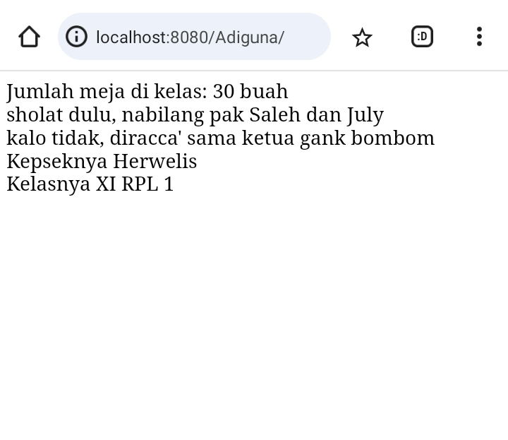

---
# PHP Dasar
## Echo & commentar
### Echo
#### Penjelasan 
`echo` adalah sebuah perintah yang digunakan untuk menampilkan output ke dalam halaman web. Dengan menggunakan `echo`, Anda dapat menampilkan teks, variabel, atau hasil operasi lainnya di dalam kode PHP, dan hasilnya akan ditampilkan pada halaman web ketika halaman tersebut dimuat oleh browser.
#### Struktur 
```php
echo "nilai yang ingin ditampilkan";
```

#### Program 
```php
<?php
    echo "Halo Selamat datang.";
?>
```
#### Hasil
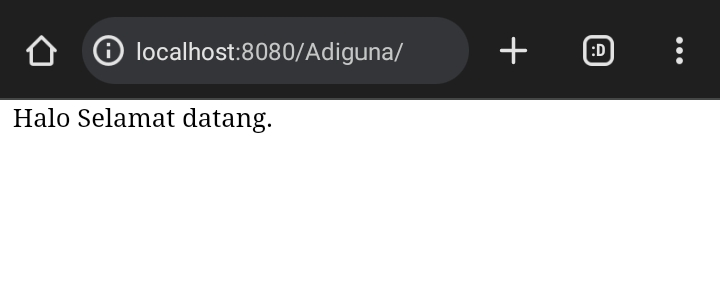
#### Analisis 
- `echo` digunakan untuk menampilkan sebuah output ke dalam halaman web
- `"Halo Selamat datang."` Text yang akan di tampilkan di halaman web.
#### Kesimpulan 
`echo` berfungsi untuk menampilkan output ke halaman web.

---
### Commentar
#### Penjelasan 
 `comment` atau komentar adalah bagian dari kode yang tidak dieksekusi oleh PHP. Komentar digunakan untuk memberikan penjelasan atau dokumentasi di dalam kode, dan komentar ini tidak akan ditampilkan pada halaman web saat dijalankan. Ada dua jenis komentar dalam PHP.
#### Struktur 
**komentar 1 baris :**
```php
// Ini adalah komentar satu baris
```

**Komentar multi-baris :**
```php
/*
 Ini adalah komentar
 multi-baris
*/
```

#### Program 
```php
<?php
// Program ini menyapa pengguna dengan nama tertentu

$nama = "Alice"; // Nama pengguna disimpan dalam variabel $nama

// Menampilkan pesan sapaan
echo "Halo, $nama! Selamat datang.";
?>
```

#### Hasil
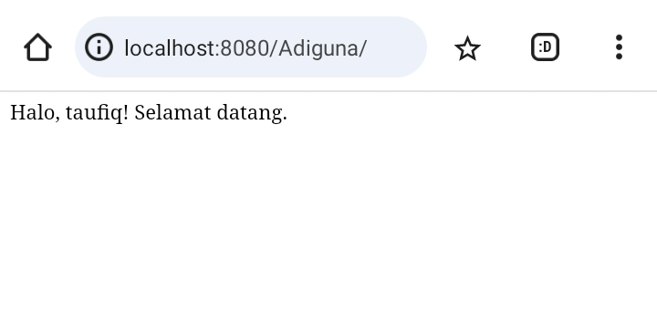

#### Analisis 
- Komentar digunakan untuk menjelaskan fungsionalitas program, memberikan informasi kepada pembaca kode, atau untuk mencatat catatan terkait kode. Mereka membantu dalam memahami maksud dan logika di balik setiap bagian dari kode PHP.
#### Kesimpulan 
Komentar adalah bagian penting dari pengkodean yang baik dan dapat membantu programmer dan pembaca kode lainnya untuk memahami tujuan dan fungsi dari setiap bagian dari program PHP. Mereka tidak mempengaruhi eksekusi program, tetapi berfungsi sebagai dokumentasi dan catatan.


---
## Variabel & Const
### Variabel 
#### Penjelasan 
Variabel adalah sebuah wadah atau tempat untuk menyimpan data di dalam program. Di dalam PHP, variabel memiliki tipe dinamis, yang berarti Anda tidak perlu mendeklarasikan tipe data saat membuat variabel. Cukup beri nama variabel dan langsung gunakan untuk menyimpan nilai.
#### Struktur 
```php
$namaVariabel = nilai;
```
#### Program 
```php
<?php
// Deklarasi variabel
$nama = "Taufiq";
$umur = 30;

// Menampilkan informasi menggunakan variabel
echo "Nama: $nama<br>";
echo "Umur: $umur tahun<br>";
?>
```
#### Hasil
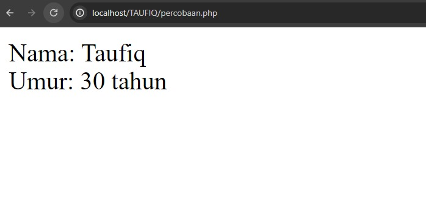

#### Analisis 
- Variabel `$nama` diinisialisasi dengan nilai string `"Taufiq".`
- Variabel `$umur` diinisialisasi dengan nilai integer `30`.
- Menggunakan fungsi echo, program mencetak informasi nama dan usia ke layar dengan nilai variabel yang dimasukkan ke dalam string.
- `<br>` digunakan untuk baris baru.

#### Kesimpulan 
Variabel adalah komponen dasar dalam pemrograman PHP (dan bahasa pemrograman lainnya) yang digunakan untuk menyimpan dan mengelola data. 

---
### Const
#### Penjelasan 
Konstanta adalah nilai yang tetap dan tidak berubah selama eksekusi program. Di PHP, Anda bisa mendefinisikan konstanta menggunakan fungsi `define()` atau keyword `const`.
#### Struktur 
```php
define('NAMA_KONSTANTA', nilai);
```

#### Program 
```php
<?php
// Mendefinisikan konstanta untuk nilai Pi
define('PI', 3.14);

// Menggunakan konstanta dalam perhitungan lingkaran
$radius = 5;
$luas = PI * $radius * $radius;

echo "Luas lingkaran dengan radius $radius adalah $luas satuan luas.";
?>
```

#### Hasil
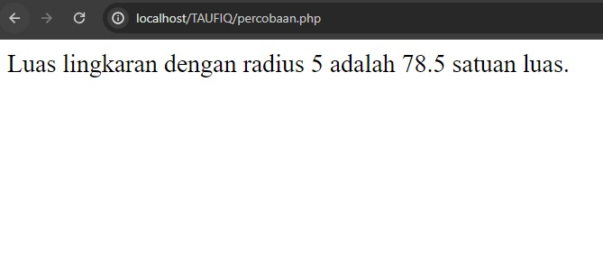

#### Analisis 
- Konstanta `PI` didefinisikan dengan menggunakan fungsi `define()`. Nilai konstanta PI disetel ke 3.14, yang merupakan perkiraan nilai Pi dalam matematika.
- Variabel `$radius` didefinisikan dengan nilai `5`.
- Luas lingkaran dihitung dengan menggunakan konstanta `PI` dan nilai `$radius`.
- Rumus untuk menghitung luas lingkaran adalah `pi * r^2`, di mana r adalah radius lingkaran.
- Hasil luas lingkaran kemudian dicetak ke layar menggunakan fungsi echo bersama dengan nilai dari variabel `$radius` dan `$luas`.
#### Kesimpulan 
Konstanta dalam PHP adalah cara untuk menyimpan nilai tetap yang tidak berubah selama eksekusi program.

---
## Operator 
### Aritmatika
#### Penjelasan
Digunakan untuk operasi matematika seperti penambahan `(+)`, pengurangan `(-)`, perkalian `(*)`, pembagian `(/)`, modulus `(%)`, dll.
#### Struktur
- Penambahan `(+)`: Menambahkan dua nilai.
- Pengurangan `(-)`: Mengurangkan nilai kedua dari nilai pertama.
- Perkalian `(*)`: Mengalikan dua nilai.
- Pembagian `(/)`: Membagi nilai pertama dengan nilai kedua.
- Modulus `(%)`: Mengembalikan sisa dari hasil pembagian.
#### Program
```php
$a = 10;
$b = 5;
$hasil_penambahan = $a + $b;
 echo " hasil tambah 10 + 5 = $hasil_penambahan"
 
$hasil_pengurangan = $a - $b;
 echo " hasil kurang 10 - 5 =  $hasil_pengurangan"
```

#### Hasil
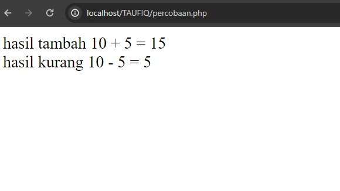

#### Analisis 
- Variabel `$a` diberi nilai `10`.
- Variabel `$b` diberi nilai `5`.
- Variabel `$hasil_penambahan` digunakan untuk menyimpan hasil penambahan antara nilai `$a` dan `$b`.
- Operator penambahan `(+)` digunakan untuk menjumlahkan nilai `$a` dan `$b`.
- Menggunakan fungsi echo untuk mencetak hasil penambahan ke layar.
- Dalam string yang dicetak, nilai dari variabel `$hasil_penambahan` dimasukkan menggunakan sintaks interpolasi string (`"hasil tambah 10 + 5 = $hasil_penambahan")`.
- Variabel `$hasil_pengurangan` digunakan untuk menyimpan hasil pengurangan antara nilai `$a` dan `$b`.
- Operator pengurangan `(-)` digunakan untuk mengurangkan nilai `$b` dari `$a`.
- Menggunakan fungsi echo untuk mencetak hasil pengurangan ke layar.
- Dalam string yang dicetak, nilai dari variabel `$hasil_pengurangan` dimasukkan menggunakan sintaks interpolasi string (`"hasil kurang 10 - 5 = $hasil_pengurangan"`).
#### Kesimpulan Program
Program di atas mengilustrasikan penggunaan operator aritmatika (`+` dan `-`) dalam PHP untuk melakukan operasi penambahan dan pengurangan antara dua nilai numerik.

---
### Perbandingan
#### Penjelasan
Operator perbandingan membandingkan dua nilai atau ekspresi dan menghasilkan nilai boolean sebagai hasilnya. Jika kondisi perbandingan terpenuhi, maka hasilnya adalah true, jika tidak terpenuhi, maka hasilnya adalah false.
#### Struktur
- Equal to `(==)`: Memeriksa apakah dua nilai sama.
- Not equal to `(!=)`: Memeriksa apakah dua nilai tidak sama.
- Identical (`===)`: Memeriksa apakah dua nilai identik (sama nilai dan tipe data).
- Not identical `(!==)`: Memeriksa apakah dua nilai tidak identik.
- Greater than `(>)`: Memeriksa apakah nilai pertama lebih besar dari nilai kedua.
- Less than `(<)`: Memeriksa apakah nilai pertama lebih kecil dari nilai kedua.
- Greater than or equal to `(>=)`: Memeriksa apakah nilai pertama lebih besar dari atau sama dengan nilai kedua.
- Less than or equal to `(<=)`: Memeriksa apakah nilai pertama lebih kecil dari atau sama dengan nilai kedua.
#### Program
```php
<?php
$a = 10;
$b = 5;

echo "Apakah $a sama dengan $b? " . ($a == $b ? 'true' : 'false') . "<br>";

echo "Apakah $a tidak sama dengan $b? " . ($a != $b ? 'true' : 'false') . "<br>";
?>
```
#### Hasil
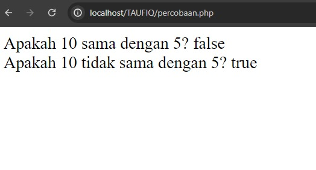
#### Analisis
- Variabel `$a` diberi nilai `10`.
- Variabel `$b`diberi nilai `5`.
- Program menggunakan operator perbandingan untuk membandingkan nilai `$a` dan `$b`.
- Operator yang digunakan adalah:
    - `==` untuk memeriksa kesamaan (equal to).
    - `!=` untuk memeriksa ketidaksamaan (not equal to).
- Dalam setiap echo, terdapat penulisan kondisi menggunakan operator ternary `(?:)` untuk menentukan hasil berdasarkan hasil perbandingan. Jika perbandingan benar `(true)`, maka akan menghasilkan string '`true`'; jika salah (`false`), maka akan menghasilkan string '`false`'.
#### Kesimpulan Program
Operator perbandingan dalam PHP digunakan untuk membandingkan dua nilai atau ekspresi dan menghasilkan nilai boolean berdasarkan hasil perbandingan tersebut.

---
### Logika
#### Penjelasan
Operator logika digunakan untuk menggabungkan dua atau lebih kondisi boolean (true atau false) untuk menghasilkan nilai boolean baru. Operator logika umumnya digunakan dalam struktur pengambilan keputusan (conditional statements) dan pengulangan (looping) untuk mengontrol alur program.

#### Struktur
- `and (&& atau and)` Menghasilkan `true` jika kedua kondisi yang dibandingkan adalah `true`.
- `OR (|| atau or)`  Menghasilkan `true` jika salah satu dari kedua kondisi yang dibandingkan adalah `true`.
- `NOT (!)` Menghasilkan kebalikan dari nilai kondisi, yaitu `true` jika kondisi awalnya `false`, dan sebaliknya.
#### Program
```php
<?php
$a = 10;
$b = 5;

// Operator AND (&&)
if ($a > 0 && $b > 0) {
    echo "Kedua nilai positif<br>";
} else {
    echo "Salah satu atau kedua nilai tidak positif<br>";
}

// Operator OR (||)
if ($a == 10 || $b == 10) {
    echo "Salah satu nilai adalah 10<br>";
} else {
    echo "Kedua nilai bukan 10<br>";
}

// Operator NOT (!)
$nilaiBenar = true;
if (!$nilaiBenar) {
    echo "Nilai seharusnya salah, tetapi tidak terjadi<br>";
} else {
    echo "Nilai benar<br>";
}
?>
```
#### Hasil
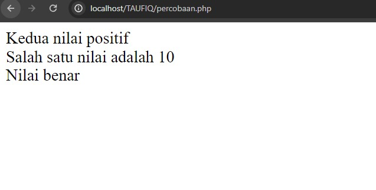

#### Analisis
- Variabel `$a` diberi nilai `10`.
- Variabel `$b` diberi nilai `5`.
- Variabel `$nilaiBenar` diberi nilai `true`.
- Memeriksa apakah kedua nilai `$a` dan `$b` positif (lebih besar dari 0). Jika kedua kondisi terpenuhi, maka pesan "Kedua nilai positif" akan dicetak. Jika salah satu atau kedua nilai tidak positif, maka pesan "Salah satu atau kedua nilai tidak positif" akan dicetak.
- Memeriksa apakah salah satu dari nilai `$a` atau `$b` adalah `10`. Jika salah satu kondisi terpenuhi, maka pesan "Salah satu nilai adalah 10" akan dicetak. Jika kedua nilai bukan `10`, maka pesan "Kedua nilai bukan 10" akan dicetak.
- Mengubah nilai boolean dari variabel `$nilaiBenar`. Jika nilai awalnya `true`, maka setelah di-negasi (`!$nilaiBenar`), hasilnya menjadi false. Namun, dalam contoh ini, kondisi if (`!$nilaiBenar`) tidak akan terpenuhi karena `$nilaiBenar` awalnya adalah `true`. Sehingga pesan "Nilai benar" akan dicetak.
#### Kesimpulan Program
Penggunaan operator logika sangat penting dalam pemrograman untuk mengontrol alur eksekusi program berdasarkan kondisi-kondisi tertentu.

---
## Conditional Statement
### IF
#### Penjelasan
`if` adalah struktur kontrol dalam pemrograman yang digunakan untuk menjalankan blok kode jika suatu kondisi terpenuhi (true). Ini memungkinkan program untuk membuat keputusan berdasarkan nilai variabel atau ekspresi tertentu.
#### Struktur
```php
if (kondisi) {
    // blok kode yang akan dijalankan jika kondisi terpenuhi
}
```
#### Program
```php 
$umur = 25;

if ($umur >= 18) {
    echo "Anda sudah dewasa.";
}
```
#### Hasil
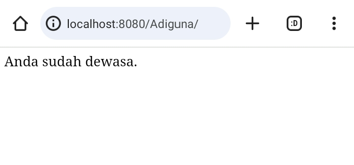

#### Analisis
- `<?php`Ini adalah tag pembuka untuk memulai blok kode PHP.
- `$umur = 25;` Baris ini mendeklarasikan variabel `$umur` dan menginisialisasinya dengan nilai 25.
- `if ($umur >= 18) {` Ini adalah awal dari sebuah blok if statement. Pernyataan ini menguji apakah nilai dari variabel `$umur`lebih besar dari atau sama dengan 18. Jika kondisinya benar, maka blok kode di dalam kurung kurawal `{}` akan dieksekusi.
- `echo "Anda sudah dewasa.";` Ini adalah pernyataan yang akan dieksekusi jika kondisi pada baris sebelumnya `($umur >= 18)` terpenuhi atau bernilai true. Pernyataan echo digunakan untuk mencetak atau menampilkan teks "Anda sudah dewasa." ke dalam output. 
- `}` Kurung kurawal menutup blok kode `if`. Semua pernyataan di dalam blok ini akan dieksekusi hanya jika kondisi pada baris 3 terpenuhi.

#### Kesimpulan Program
program PHP yang mengecek apakah nilai variabel $umur lebih besar dari atau sama dengan 18. Jika ya, maka program akan mencetak pesan "Anda sudah dewasa.".

---
### IF-ELSE
#### Penjelasan
`if else` adalah struktur kontrol dalam pemrograman yang digunakan untuk mengatur alur eksekusi berdasarkan evaluasi kondisi. Dengan `if else`, blok kode tertentu akan dieksekusi jika kondisi yang diberikan adalah benar (true), dan blok alternatif akan dieksekusi jika kondisi tersebut adalah salah (false).
#### Struktur
```php
if (kondisi) {
    // blok kode dieksekusi jika kondisi benar (true)
} else {
    // blok kode dieksekusi jika kondisi salah (false)
}
```
#### Program
```php
$umur = 20;

if ($umur >= 18) {
    echo "Anda sudah dewasa.";
} else {
    echo "Anda masih di bawah umur.";
}

```
#### Hasil


#### Analisis
- `$umur = 20;` baris ini mendeklarasikan variabel umur dengan nilai 20.
- `if ($umur >= 18)` Ini adalah kondisi yang dievaluasi. Jika nilai variabel $umur lebih besar dari atau sama dengan 18, maka blok kode yang akan di eksekusi `echo "Anda sudah dewasa.";`.
- `else` Jika kondisi `($umur >= 18)` tidak terpenuhi  (artinya $umur kurang dari 18), maka blok kode yang akan di eksekusi adalah `echo "Anda masih di bawah umur.";`.
#### Kesimpulan Program
program PHP yang mengecek apakah nilai variabel `$umur` lebih besar dari atau sama dengan 18. Jika ya, maka program akan mencetak pesan "Anda sudah dewasa.", tetapi jika tidak, maka program akan mencetak pesan "Anda Masih dibawah umur".

---
### IF-ELSE IF-ELSE
#### Penjelasan
konstruksi `if-else-if-else` digunakan untuk mengevaluasi beberapa kondisi berturut-turut. PHP akan mengevaluasi setiap kondisi secara berurutan dan menjalankan blok kode yang sesuai dengan kondisi yang pertama kali terpenuhi.
#### Struktur
```php
if (kondisi1) {
    // blok kode untuk kondisi1
} elseif (kondisi2) {
    // blok kode untuk kondisi2
} elseif (kondisi3) {
    // blok kode untuk kondisi3
} else {
    // blok kode default (jika tidak ada kondisi yang terpenuhi)
}
```
#### Program
```php
$nilai = 75;

if ($nilai > 90) {
    echo "Nilai Anda sangat baik";
} elseif ($nilai > 75) {
    echo "Nilai Anda cukup baik";
} elseif ($nilai > 60) {
    echo "Nilai Anda memadai";
} else {
    echo "Anda perlu belajar lebih giat";
}
```
#### Hasil
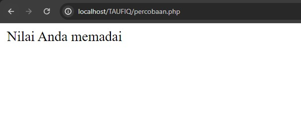
#### Analisis
- Pernyataan ini mengevaluasi apakah variabel `$nilai` lebih besar dari `90`. Jika kondisi `$nilai > 90` benar (true), maka pernyataan `echo "Nilai Anda sangat baik";` akan dieksekusi.
- Pernyataan `else if` mengevaluasi apakah variabel `$nilai` lebih besar dari `75`, hanya jika kondisi Pertama (`$nilai > 90`) tidak terpenuhi. Jika kondisi `$nilai > 75` benar (true), maka pernyataan `echo "Nilai Anda cukup baik";`akan dieksekusi.
- Pernyataan `elseif` ini akan dievaluasi jika kondisi Pertama dan kedua (`$nilai > 90` dan `$nilai > 75`) tidak terpenuhi. Jika kondisi `$nilai > 60` benar (true), maka pernyataan `echo "Nilai Anda memadai";` akan dieksekusi.
- Jika variabel `$nilai` tidak memenuhi kondisi `$nilai > 90`, `$nilai > 75`, dan `$nilai > 60`, maka pernyataan `echo "Anda perlu belajar lebih giat";` akan dieksekusi.
#### Kesimpulan Program
If else If else merupakan sebuah statement, Setiap pernyataan dieksekusi secara berurutan dari atas ke bawah. Begitu suatu kondisi terpenuhi, blok kode yang terkait dieksekusi, dan evaluasi berhenti.

---
### SWITCH CASE
#### Penjelasan
`Switch Case` adalah sebuah struktur pengendalian alur dalam pemrograman yang digunakan untuk memilih eksekusi kode berdasarkan nilai dari sebuah variabel atau ekspresi. Struktur ini memungkinkan kita untuk mengevaluasi ekspresi terhadap sejumlah nilai yang mungkin dan menjalankan blok kode yang sesuai dengan nilai yang cocok.
#### Struktur
```php
switch ($variabel) {
    case nilai1:
        // blok kode untuk nilai1
        break;
    case nilai2:
        // blok kode untuk nilai2
        break;
    case nilai3:
        // blok kode untuk nilai3
        break;
    default:
        // blok kode default (jika tidak ada nilai yang cocok)
        break;
}
```
#### Program
```php
$hari = 3;

switch ($hari) {
    case 1:
        echo "Hari ini adalah Senin";
        break;
    case 2:
        echo "Hari ini adalah Selasa";
        break;
    case 3:
        echo "Hari ini adalah Rabu";
        break;
    case 4:
        echo "Hari ini adalah Kamis";
        break;
    case 5:
        echo "Hari ini adalah Jumat";
        break;
    case 6:
        echo "Hari ini adalah Sabtu";
        break;
    case 7:
        echo "Hari ini adalah Minggu";
        break;
}
```
#### Hasil
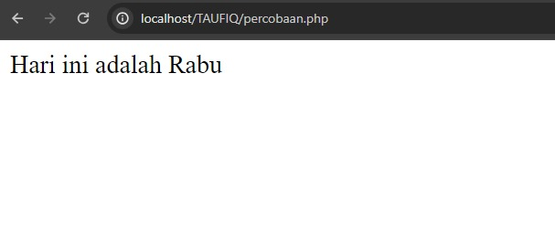

#### Analisis
- Ekspresi yang dievaluasi dalam switch case adalah nilai dari variabel $hari.
- PHP akan mencocokkan nilai $hari dengan setiap case yang ada.
- Jika nilai $hari cocok dengan case tertentu, maka blok kode di dalam case tersebut akan dieksekusi.
- Penggunaan break; setelah setiap case menghentikan eksekusi switch case setelah blok kode yang terkait dieksekusi.
#### Kesimpulan Program
Switch case adalah struktur pengendalian alur yang berguna dalam pemrograman untuk mengevaluasi ekspresi terhadap sejumlah nilai dan menjalankan blok kode berdasarkan nilai yang cocok. 

---
## Array
### Array 1 dimensi
#### Penjelasan
Array 1 Dimensi adalah struktur data dalam pemrograman yang digunakan untuk menyimpan kumpulan nilai atau elemen dengan tipe data yang sama secara berurutan dalam satu variabel. Setiap elemen dalam array memiliki indeks numerik yang digunakan untuk mengakses nilainya.
#### Struktur
```php
$nama_array = [nilai1, nilai2, nilai3, ...];
```
#### Program
```php
$nama_mahasiswa = ["Taufiq", "Adiguna", "Opi", "Asep", "angga"];

echo $nama_mahasiswa[0];
echo $nama_mahasiswa[3];
```
#### Hasil
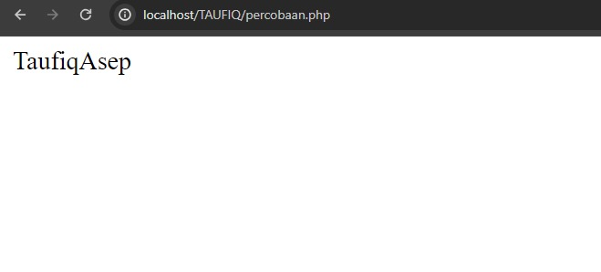

#### Analisis
- Array `$nama_mahasiswa` dibuat dengan 5 elemen, di mana setiap elemen adalah nama seorang siswa.
- Ini adalah cara menginisialisasi array 1 dimensi dalam PHP. Elemen-elemen array dipisahkan oleh koma `(",")` dan diapit oleh tanda kurung siku 
  `([ ])`.
#### Kesimpulan Program
Array 1 dimensi adalah struktur data yang penting dalam pemrograman untuk menyimpan dan mengelola kumpulan nilai dengan tipe data yang sama. 

---
### Array Asosiatif
#### Penjelasan
Array Asosiatif adalah tipe array dalam pemrograman yang menggunakan kunci (key) yang dapat ditentukan sendiri oleh pengguna untuk mengakses nilai-nilai (values) yang terkait. Dalam array asosiatif, setiap elemen array memiliki pasangan kunci-nilai yang memungkinkan pengaksesan nilai berdasarkan kunci tertentu.
#### Struktur
```php
$nama_array = [
    'kunci1' => nilai1,
    'kunci2' => nilai2,
    'kunci3' => nilai3,
];
```
#### Program
```php
$kontak = [
    'nama' => 'Taufiq Adiguna',
    'email' => 'adiguna@gmail.com',
    'telepon' => '0854-456-7890'
];

echo $kontak['nama'];
echo $kontak['email'];
echo $kontak['telepon'];
```
#### Hasil
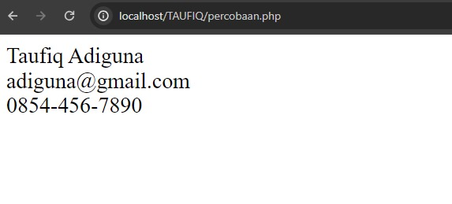


#### Analisis
- Di sini, `$kontak` adalah nama variabel yang digunakan untuk menyimpan array asosiatif.
- Array asosiatif ini memiliki tiga pasangan kunci-nilai:
    - Kunci pertama `nama` memiliki nilai `Taufiq Adiguna`.
     - Kunci kedua `email` memiliki nilai `adiguna@gmail.com`.
     - Kunci ketiga `telepon` memiliki nilai `0854-456-7890`.
- `echo $kontak['nama'];` menghasilkan output 'Taufiq Adiguna', karena kita mengakses nilai yang terkait dengan kunci 'nama'.
- `echo $kontak['email'];` dan `echo $kontak['telepon'];` menghasilkan output masing-masing `adiguna@gmail.com` dan `0854-456-7890`.
#### Kesimpulan Program
Array asosiatif adalah struktur data yang kuat dalam pemrograman PHP yang memungkinkan pengguna untuk mengelola data dengan lebih terstruktur menggunakan kunci-kunci yang dapat ditentukan sendiri. 

---
### Array Multidimensi 
#### Penjelasan
Array Multidimensi adalah tipe array dalam pemrograman yang memungkinkan penyimpanan data dalam bentuk beberapa dimensi (lebih dari satu dimensi). Dengan array multidimensi, kita dapat mengorganisir data dalam bentuk tabel yang terdiri dari baris dan kolom, atau dalam bentuk struktur bertingkat yang lebih kompleks.
#### Struktur
```php
$nama_array = [
    [nilai1, nilai2, nilai3],
    [nilai4, nilai5, nilai6],
    [nilai7, nilai8, nilai9]
];
```
#### Program
```php
$siswa = [
    ['Taufiq', 25, 'Fisika'],
    ['adiguna', 22, 'Matematika'],
    ['ahsan', 24, 'Biologi']
];

echo $siswa[0][0];
echo $siswa[1][2]; 
echo $siswa[2][1]; 
```
#### Hasil
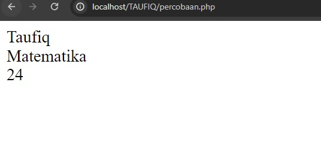

#### Analisis
- disini kita mendefinisikan variabel siswa sebagai Array multidimensi yang terdiri dari tiga array di dalamnya, masing-masing mewakili satu mahasiswa. Setiap array internal (sub-array) berisi informasi nama, usia, dan mata kuliah mahasiswa.
- `$mahasiswa[0][0]` mengembalikan nilai 'Taufiq', yaitu nama mahasiswa pertama.
- `$mahasiswa[1][2]` mengembalikan nilai 'Matematika', yaitu mata kuliah mahasiswa kedua.
- `$mahasiswa[2][1]` mengembalikan nilai 24, yaitu usia mahasiswa ketiga.
#### Kesimpulan Program
Array `$siswa` terdiri dari beberapa sub-array yang mewakili informasi siswa (nama, usia, mata pelajaran). Dengan menggunakan indeks baris dan kolom (`$siswa[0][0]`, `$siswa[1][2]`, `$siswa[2][1]`), kita dapat mengakses dan menampilkan nilai-nilai individu dalam array multidimensi.

---
## Var_dump
### Penjelasan
`var_dump` adalah sebuah fungsi dalam PHP yang digunakan untuk menampilkan informasi tentang variabel, termasuk tipe datanya dan nilai yang disimpannya. Fungsi ini sangat berguna dalam debugging karena memberikan rincian lengkap tentang isi dari variabel yang sedang diperiksa.
### Struktur
```php
var_dump($variabel);
```
### Program
```php
$siswa = [
[['nis' => 123],
['nama' => 'rahman'],
['jurusan' => 'rpl']],

[['nis' => 321],
['nama' => 'rahmat'],
['jurusan' => 'tkj']]
];

Var_dump($siswa);
```
### Hasil
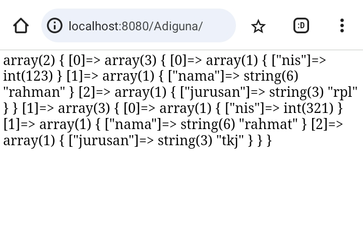

### Analisis
- Variabel `$siswa` adalah array multidimensi yang berisi dua elemen, masing-masing merepresentasikan satu siswa. 
- Setiap elemen siswa adalah array yang berisi tiga sub-array untuk `nis`, `nama`, dan `jurusan`. Struktur ini kompleks dan dapat disederhanakan untuk kemudahan akses dan manipulasi data.
### Kesimpulan Program
Variabel `$siswa` adalah array multidimensi yang berisi data tentang siswa dalam bentuk sub-array. Setiap sub-array dalam elemen utama `$siswa` berisi informasi terpisah tentang `nis`, `nama`, dan `jurusan` siswa. Penggunaan `var_dump` memberikan pandangan yang jelas tentang struktur dan isi dari array ini, yang sangat berguna untuk memahami bagaimana data tersebut diatur dan diakses. 

---
## Looping (Perulangan)
### For
#### Penjelasan
For Loop dalam PHP adalah sebuah struktur pengulangan (loop) yang digunakan untuk mengeksekusi blok kode secara berulang berdasarkan kondisi atau iterasi tertentu
#### Struktur
```php
for (inisialisasi; kondisi; iterasi) {
    // blok kode yang akan diulang
}
```
#### Program
```php
for ($i = 1; $i <= 5; $i++) {
    echo $i . " ";
}
```
#### Hasil
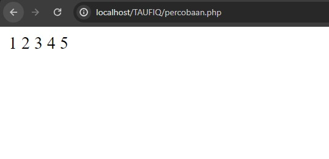

#### Analisis
- Variabel `$i` diinisialisasi dengan nilai `1`.
- Kondisi `$i <= 5` menentukan batasan iterasi. Loop akan terus berjalan selama nilai `$i` kurang dari atau sama dengan 5.
- Pada setiap iterasi, nilai `$i` dicetak dengan tambahan spasi menggunakan perintah `echo $i . " ";`.
- Setelah mencetak nilai, nilai `$i` akan diinkrementasi dengan `$i++` untuk memperbarui nilai iterasi.

#### Kesimpulan Program
Program menggunakan for loop untuk mencetak angka dari 1 hingga 5 dengan spasi di antara setiap angka

---
### While 
#### Penjelasan
While loop digunakan untuk mengeksekusi blok kode selama kondisi tertentu terpenuhi. Selama kondisi tersebut benar (true), blok kode akan terus dieksekusi.
#### Struktur
```php
while (kondisi) {
    // blok kode yang akan diulang
}
```
#### Program
```php
$i = 1;
while ($i <= 5) {
    echo $i . " ";
    $i++;
}
```
#### Hasil

#### Analisis
- Variabel `$i` diinisialisasi dengan nilai 1.
- Selama nilai `$i` kurang dari atau sama dengan 5, blok kode dalam while loop akan dieksekusi.
- Pada setiap iterasi:
   - Angka `$i` dicetak ke dalam output menggunakan perintah `echo $i . " ";`.
   - Nilai `$i` kemudian diinkrementasi `($i++)`, yaitu nilai `$i`akan bertambah 1.
#### Kesimpulan Program
While Loop: Digunakan untuk mengeksekusi blok kode selama kondisi tertentu terpenuhi.

---
### Do-while
#### Penjelasan
Do-while loop mirip dengan while loop, tetapi bedanya blok kode akan dieksekusi setidaknya satu kali sebelum kondisi dicek. Selama kondisi terpenuhi (true), blok kode akan terus dieksekusi
#### Struktur
```php
do {
    // blok kode yang akan diulang
} while (kondisi);
```
#### Program
```php
$i = 1;
do {
    echo $i . " ";
    $i++;
} while ($i <= 5);
```
#### Hasil


#### Analisis
- Variabel `$i` diinisialisasi dengan nilai 1.
- Blok kode dalam do-while loop akan dieksekusi setidaknya satu kali karena kondisi dicek setelah blok kode dijalankan.
- Selama nilai `$i` kurang dari atau sama dengan 5, blok kode akan terus dieksekusi.
- Pada setiap iterasi:
    - Angka `$i` dicetak ke dalam output menggunakan perintah `echo $i . " ";`.
     - Nilai `$i` kemudian diinkrementasi (`$i++)`, yaitu nilai `$i` akan bertambah 1.
#### Kesimpulan Program
Do-While Loop: Mirip dengan while loop, tetapi blok kode dieksekusi setidaknya satu kali sebelum kondisi dicek.

---
### Foreach
#### Penjelasan
Foreach digunakan khusus untuk mengulang elemen-elemen dalam array atau objek. Loop ini sangat berguna untuk mengakses setiap elemen dalam struktur data seperti array.
#### Struktur
```php
foreach ($array as $nilai) {
    // blok kode yang akan diulang
}
```
#### Program
```php
<?php
$data_penduduk = array(
    'Dodi' => '12',
    'Joana' => '20',
    'Gulamo' => '24',
    'Rahmat' => '45'
);

foreach ($data_penduduk as $nama => $umur) {
    echo $nama . " - " . $umur . "<br>";
}
?>
```
#### Hasil
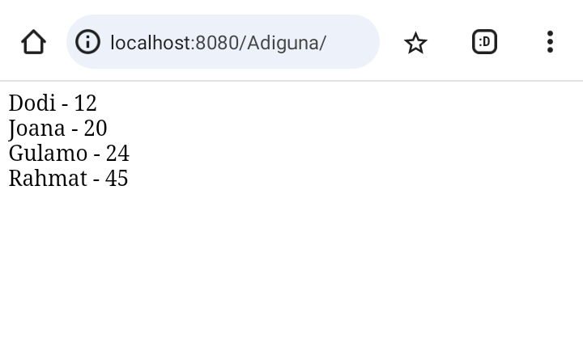

#### Analisis
-  `$data_penduduk = array('Dodi' => '12','Joana' => '20','Gulamo' => '24','Rahmat' => '45' );` Mendefinisikan array asosiatif bernama `$data_penduduk`. Array ini memiliki empat elemen, di mana setiap elemen terdiri dari pasangan kunci (nama) dan nilai (umur).
- `foreach ($data_penduduk as $nama => $umur) {` `foreach` digunakan untuk mengiterasi setiap elemen dalam array `$data_penduduk`. Dalam setiap iterasi, kunci dari elemen disimpan dalam variabel `$nama` dan nilai disimpan dalam variabel `$umur`.
- `echo $nama . " - " . $umur . "<br>";`echo digunakan untuk mencetak nama dan umur dari setiap elemen. Menggabungkan variabel `$nama` dan `$umur` dengan string `" - "` di antara mereka. Tag HTML `<br>` ditambahkan di akhir untuk membuat baris baru setelah setiap output.
####  Kesimpulan Program
`Foreach Loop` Digunakan khusus untuk mengulang elemen-elemen dalam array atau objek, sangat berguna untuk mengakses setiap elemen dalam struktur data.

---
## Function
#### Penjelasan
Function (fungsi) dalam PHP adalah blok kode yang dapat dipanggil secara berulang untuk melakukan tugas tertentu. Fungsi digunakan untuk mengorganisir kode agar lebih terstruktur, memungkinkan untuk mengisolasi logika tertentu, dan memfasilitasi penggunaan ulang kode.
#### Struktur
```php
function namaFungsi($parameter1, $parameter2, ...) {
    // Body fungsi
    // Kode untuk melakukan tugas tertentu
    return $nilaiKembalian; // opsional
}
```

- `function`: Kata kunci untuk mendefinisikan fungsi.
- `namaFungsi`: Nama unik untuk fungsi.
- `($parameter1, $parameter2, ...)` Parameter atau argumen yang diterima oleh fungsi (opsional).
- `{ ... }` Blok kode yang berisi logika fungsi.
- `return $nilaiKembalian;` : Statement untuk mengembalikan nilai dari fungsi (opsional).
#### Program
```php
<?php
// Mendefinisikan fungsi untuk menghitung luas lingkaran
function hitungLuasLingkaran($radius) {
    $luas = 3.14 * $radius * $radius;
    return $luas;
}

// Memanggil fungsi dan menampilkan hasilnya
$radius = 5;
$hasilLuas = hitungLuasLingkaran($radius);
echo "Luas lingkaran dengan radius $radius adalah $hasilLuas satuan luas.";
?>
```
#### Hasil


#### Analisis
- Fungsi `hitungLuasLingkaran` didefinisikan dengan menggunakan kata kunci function.
- Nama fungsi adalah `hitungLuasLingkaran`.
- Fungsi menerima satu parameter yaitu `$radius`.
- Di dalam fungsi, luas lingkaran dihitung menggunakan rumus matematika `3.14 * $radius * $radius`.
- Hasil perhitungan luas lingkaran disimpan dalam variabel lokal `$luas`.
- Fungsi mengembalikan nilai luas dengan menggunakan pernyataan `return $luas;`.
#### Kesimpulan Program 
Function (fungsi) adalah bagian penting dari pemrograman PHP yang memungkinkan untuk mengelompokkan kode ke dalam unit terpisah dan memudahkan penggunaan kembali kode. 

---
## PHP Form
### GET Method
#### Penjelasan
Metode GET adalah salah satu cara pengiriman data dari browser ke server dalam protokol HTTP. Dalam konteks PHP, metode GET digunakan untuk mengumpulkan data yang dikirimkan melalui URL sebagai parameter. Data yang dikirimkan melalui metode GET muncul di bagian URL dan dapat diakses menggunakan variabel global `$_GET` di PHP.
#### Struktur

##### Form HTML untuk Mengirim Data:
```php
<form action="proses.php" method="get">
    Nama: <input type="text" name="nama"><br>
    Umur: <input type="text" name="nama"><br>
    <input type="submit" value="Kirim">
</form>
```

##### Script PHP untuk Memproses Data (proses.php):
```php
<?php
// Mengakses data yang dikirimkan melalui metode GET
$nama = $_GET['nama'];
$umur = $_GET['umur'];

// Menampilkan data yang diterima
echo "Nama: " . $nama . "<br>";
echo "Umur: " . $umur . " tahun";
?>
```
#### Program
##### Form HTML (form_get.html):
```html
<!DOCTYPE html>
<html lang="en">

<head>
    <title>Document</title>
</head>

<body>
    <!-- Pada atribut action, kalian tuliskan nama file php yang bertugas untuk mengelola atau menangkap data dari form tersebut. -->
    <form action="proses_get.php"method="GET">
        <input type="text" name="nama"                 placeholder="Masukkan nama">
        <input type="number" name="umur"               placeholder="Masukkan umur"> <br>
        <button type="submit">Kirim</button>
    </form>
</body>
<!-- untuk mengambil data -->
</html>
```
##### Script PHP (proses.php):
```php
<?php
// Key dari array-nya, sesuai dengan nama dari atribut name di setiap input-nya
$nama = $_GET["nama"];
$umur = $_GET["umur"];
?>

<!DOCTYPE html>
<html lang="en">

<head>
    <meta charset="UTF-8">
    <meta name="viewport"       content="width=device-width, initial-scale=1.0">
    <title>GET</title>
</head>

<body>
// Ini adalah versi singkatnya dari php echo,yang fungsinya untuk menampilkan data
    <p>Nama anda <?= $nama ?></p>
    <p>Umur anda <?= $umur ?> tahun</p>
</body>

</html>
```
#### Hasil
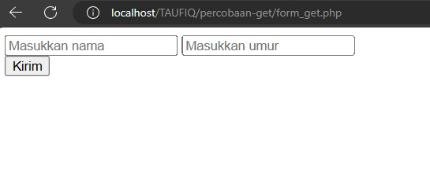

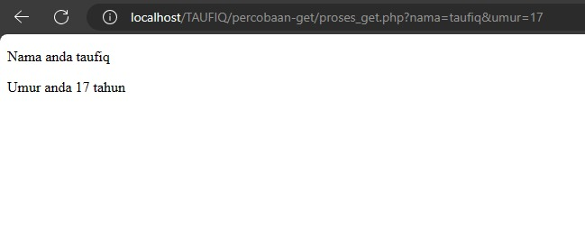
#### Analisis
##### HTML
- `<form action="proses_post.php" method="POST">` Form ini dikonfigurasi untuk mengirim data  menggunakan metode POST ke file proses_post.php.
- `input type="text" name="nama_lengkap" placeholder="Masukkan nama">` digunakan untuk  meminta user untuk memasukkan nama_lengkap dengan `type=text`.
- `<input type="number" name="umur" placeholder="Masukkan umur">` digunakan untuk meminta user untuk memasukkan umurnya dengan `type=number`.
- `<button type="submit">Kirim</button>` digunakan untuk mengirim data ke `proses_post.php` yang sudah di isi oleh user.

##### PHP
- Nilai dari `$_POST["nama"]` disimpan dalam variabel `$nama`.
- Nilai dari `$_POST["umur"]` disimpan dalam variabel `$umur`.
- `<p>Nama anda <?= $nama ?></p>` menampilkan nama user yang diisi, dengan memanggil variabel `$nama`
- `<p>Umur anda <?= $umur ?> tahun</p>`  menampilkan umur user yang di isi, dengan memanggil variabel `$umur
#### Kesimpulan Program
Program PHP di atas adalah contoh sederhana penggunaan metode GET untuk mengambil dan memproses data yang dikirimkan melalui URL. 

---
### POST Method
#### Penjelasan
Metode POST adalah salah satu cara pengiriman data dari browser ke server dalam protokol HTTP. Dalam konteks PHP, metode POST digunakan untuk mengirim data dari formulir HTML atau permintaan HTTP lainnya dari client ke server. Data yang dikirim menggunakan metode POST tidak terlihat di URL, sehingga cocok digunakan untuk mengirim data sensitif seperti password.
#### Struktur
##### HTML
```html
<form action="proses.php" method="POST">
    Nama: <input type="text" name="nama"><br>
    Umur: <input type="text" name="nama"><br>
    <input type="submit" value="Kirim">
</form>
```
##### PHP
```PHP
<?php
// Mengakses data yang dikirimkan melalui metode GET
$nama = $_GET['nama'];
$umur = $_GET['umur'];

// Menampilkan data yang diterima
echo "Nama: " . $nama . "<br>";
echo "Umur: " . $umur . " tahun";
?>
```

#### Program
##### Form html
```html
<!DOCTYPE html>
<html lang="en">

<head>
    <title>Document</title>
</head>
<body>
    <!-- Pada atribut action, kalian tuliskan nama file php yang bertugas untuk mengelola atau menangkap data dari form tersebut. -->
    <form action="proses_post.php" method="POST">
        <input type="text" name="nama" placeholder="Masukkan nama">
        <input type="number" name="umur" placeholder="Masukkan umur">
        <input type="password" name="password" placeholder="Masukkan password"><br>
        <button type="submit">Kirim</button>
    </form>
</body>
<!-- untuk mengirim data -->
</html>
```
##### Script PHP
```php
<?php
// Key dari array-nya, sesuai dengan nama dari atribut name di setiap input-nya
$nama = $_POST["nama"];
$umur = $_POST["umur"];

var_dump($_POST);

?>

<!DOCTYPE html>
<html lang="en">
<head>
    <title>POST</title>
</head>
<body>
    <p>Nama anda <?= $nama ?></p>
    <p>Umur anda <?= $umur ?> tahun</p>
    <p>Password anda aman!</p>
</body>
</html>
```

#### Hasil
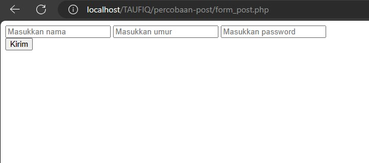

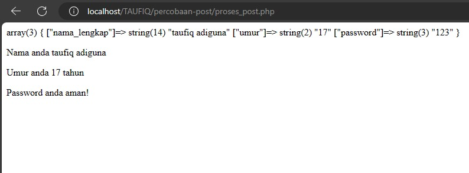

#### Analisis
##### HTML
- `<form action="proses_post.php" method="POST">` Form ini dikonfigurasi untuk mengirim data menggunakan metode POST ke file proses_post.php.
- `input type="text" name="nama_lengkap" placeholder="Masukkan nama">` digunakan untuk  meminta user untuk memasukkan nama_lengkap dengan `type=text`.
- `<input type="number" name="umur" placeholder="Masukkan umur">` digunakan untuk meminta user untuk memasukkan umurnya dengan `type=number`.
- `<input type="password" name="password" placeholder="Masukkan password">` digunakan untuk meminta user untuk memasukkan umurnya dengan `type=password`.
- `<button type="submit">Kirim</button>` digunakan untuk mengirim data ke `proses_post.php` yang sudah di isi oleh user.

##### PHP
- Nilai dari `$_POST["nama"]` disimpan dalam variabel `$nama`.
- Nilai dari `$_POST["umur"]` disimpan dalam variabel `$umur`.
- `var_dump($_POST)` digunakan untuk mencetak seluruh isi array` $_POST` yang diterima dari form. 
- `<p>Nama anda <?= $nama ?></p>` menampilkan nama user yang diisi, dengan memanggil variabel `$nama`
- `<p>Umur anda <?= $umur ?> tahun</p>`  menampilkan umur user yang di isi, dengan memanggil variabel `$umur`
- `<p>Password anda aman!</p>` menampilkan pesan dengan tag `<p>`.

#### Kesimpulan Program
Metode POST dalam PHP adalah cara untuk mengirimkan data dari client ke server dengan cara yang lebih aman dan  tersembunyi. 

---