# Langkah - Langkah Penggunaan apache (web server)


1. *Instalasi Apache*:
    
    - Unduh paket instalasi Apache dari situs web resminya atau gunakan package manager jika Anda menggunakan sistem operasi Linux. Untuk Windows, Anda dapat menggunakan installer yang disediakan.
2. *Konfigurasi Apache*:
    
    - Setelah instalasi selesai, Anda perlu melakukan beberapa konfigurasi dasar, seperti menentukan direktori root web, mengatur virtual host jika Anda memiliki beberapa situs, dan mengonfigurasi modul Apache sesuai kebutuhan.
3. *Memulai Server*:
    
    - Setelah konfigurasi selesai, Anda bisa memulai Apache. Di Linux, Anda bisa menggunakan perintah seperti sudo systemctl start apache2 untuk Debian/Ubuntu, atau sudo systemctl start httpd untuk CentOS/RHEL. Di Windows, Anda bisa memulai Apache melalui layanan "Services" atau dengan menjalankan perintah httpd -k start dari command prompt.
4. *Tes Koneksi*:
    
    - Buka browser web dan akses http://localhost atau http://127.0.0.1. Jika instalasi berhasil, Anda akan melihat halaman selamat datang dari Apache.
5. *Menyimpan File Situs Web*:
    
    - Letakkan file-file situs web Anda di direktori root web yang telah Anda konfigurasi sebelumnya. Secara default, di banyak instalasi Apache, direktori root web terletak di /var/www/html untuk Linux atau C:\xampp\htdocs untuk Windows.
6. *Mengonfigurasi Situs (Opsional)*:
    
    - Jika Anda memiliki beberapa situs web, Anda dapat menggunakan konfigurasi virtual host untuk mengonfigurasi setiap situs secara terpisah.
7. *Uji Situs Web*:
    
    - Setelah menyimpan file-file situs web Anda, coba akses situs web Anda melalui browser untuk memastikan semuanya berfungsi dengan baik.
8. *Pemantauan dan Pemeliharaan*:
    
    - Secara teratur periksa log aktivitas Apache untuk mengetahui masalah atau serangan keamanan. Pastikan untuk melakukan pemeliharaan rutin, seperti memperbarui software dan mengoptimalkan konfigurasi server.

Itu adalah langkah-langkah umum untuk menggunakan Apache sebagai web server. Pastikan untuk merujuk ke dokumentasi resmi Apache untuk informasi lebih lanjut atau konfigurasi khusus yang mungkin diperlukan.


---
# KONEKSI DATABASE
## Program 
```php
$koneksi = mysqli_connect('localhost', 'root', '', 'basis_data');
 if($koneksi) {
    echo "koneksi berhasil";
 }else{
    echo "koneksi gagal";
 }
```
## Hasil
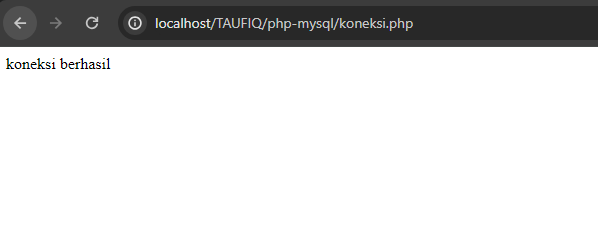

## Analisis
-  Fungsi `mysqli_connect` digunakan untuk menginisialisasi koneksi ke database MySQL.
- Parameter pertama `'localhost'` menunjukkan bahwa server database berada di mesin lokal.
- Parameter kedua `'root'` adalah nama pengguna (username) untuk mengakses MySQL.
- Parameter ketiga `''` adalah password untuk pengguna 'root'. Dalam kasus ini, passwordnya kosong.
- Parameter keempat `'basis_data'` adalah nama database yang akan dihubungkan.
- terdapat kondisi `if($koneksi) { echo "koneksi berhasil";` dimana jika berhasil akan menampilkan koneksi berhasil
- `else{ echo "koneksi gagal"; }` jika koneksi gagal akan tampil pesan koneksi gagal
## Kesimpulan
Kode tersebut menghubungkan aplikasi PHP ke database MySQL menggunakan `mysqli_connect`, dan menampilkan pesan kesalahan jika koneksi gagal.

---
# TAMPILKAN DATA
## Program 
```php
<!DOCTYPE html>
<html lang="en">
<head>
    <meta charset="UTF-8">
    <meta name="viewport" content="width=device-width, initial-scale=1.0">
    <title>index tabel</title>
</head>
<body>
    <h2>Data Siswa Berprestasi</h2>
    <a href="tambah.php">+Tambah Data Baru</a><br><br>
    <table border="5">
    <tr>
        <th>id_siswa</th>
        <th>nama</th>
        <th>email</th>
        <th>jenis_kelamin</th>
        <th>alamat</th>
        <th>Aksi</th>
    </tr>

    <?php
    include "koneksi.php";
    $i = 1;
    $query = mysqli_query($koneksi, "SELECT * FROM siswa");
    while ($data = mysqli_fetch_array($query)) {
    ?>

    <tr>
        <td><?php echo $i; ?></td>
        <td><?php echo $data['nama']; ?></td>
        <td><?php echo $data['email']; ?></td>
        <td><?php echo $data['jenis_kelamin']; ?></td>
        <td><?php echo $data['alamat']; ?></td>
        <td>
            <a href="ubah.php?id=<?= $data['id_siswa']; ?>">Ubah</a> |
            <a href="hapus.php?id=<?= $data['id_siswa']; ?>">Hapus</a> |
        </td>
    </tr>
    <?php
    $i++;
    }
    ?>
    </table>
</body>
</html>
```
## Hasil
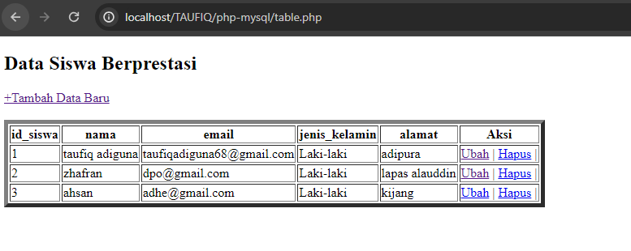

## Analisis
- `<h2>Data Siswa Berprestasi</h2>`: Menampilkan judul bagian dengan teks "Data Siswa Berprestasi".
- `<a href="tambah.php">+Tambah Data Baru</a>`: Tautan untuk menambah data baru, mengarahkan ke "tambah.php".
- `<table border="5">`: Membuat tabel dengan border sebesar 5 piksel.
- `<tr>`: Mendefinisikan baris dalam tabel.
- `<th>`: Mendefinisikan header kolom dalam tabel untuk `id_siswa`, `nama`, `email`, `jenis_kelamin`, `alamat`, dan `Aksi`.
- `include "koneksi.php";`: Menghubungkan skrip PHP ke file koneksi database `koneksi.php`.
- `$i = 1;`: Menginisialisasi variabel penghitung untuk nomor baris.
- `$query = mysqli_query($koneksi, "SELECT * FROM siswa");`: Menjalankan query untuk mengambil semua data dari tabel `siswa`.
- `while ($data = mysqli_fetch_array($query))`: Loop untuk mengambil setiap baris data dari hasil query dan menyimpannya dalam variabel `$data`.
- `<td><?php echo $i; ?></td>`: Menampilkan nomor baris.
- `<td><?php echo $data['nama']; ?></td>`: Menampilkan nama siswa.
- `<td><?php echo $data['email']; ?></td>`: Menampilkan email siswa.
- `<td><?php echo $data['jenis_kelamin']; ?></td>`: Menampilkan jenis kelamin siswa.
- `<td><?php echo $data['alamat']; ?></td>`: Menampilkan alamat siswa.
- `<a href="ubah.php?id=<?= $data['id_siswa']; ?>">Ubah</a>`: Tautan untuk mengubah data siswa berdasarkan `id_siswa`.
- `<a href="hapus.php?id=<?= $data['id_siswa']; ?>">Hapus</a>`: Tautan untuk menghapus data siswa berdasarkan `id_siswa`.
- `$i++`: Menambahkan nilai variabel `$i` untuk nomor baris berikutnya.
- `</tr>`: Menutup baris tabel.
- `</table>`: Menutup tabel.
## Kesimpulan
Program ini mengambil data dari tabel `siswa` dan menampilkan daftar mobil beserta pemiliknya. Selain itu, program juga menampilkan pesan yang menyapa pemilik mobil pertama dalam daftar.

---
# TAMBAHKAN DATA
## Program 
```php
<!DOCTYPE html>
<html lang="en">
<head>
    <title>Document</title>
</head>
<body>
    <h2>Tambah Data</h2>
    <?php
    include "koneksi.php";

    if(isset($_POST['nama'])){
        $nama           = $_POST['nama'];
        $email          = $_POST['email'];
        $jenis_kelamin  = $_POST['jenis_kelamin'];
        $alamat         = $_POST['alamat'];

        $query = mysqli_query($koneksi, "INSERT into siswa(nama,email,jenis_kelamin,alamat) values ('$nama','$email','$jenis_kelamin','$alamat')");
        if($query) {
            echo "<script>
            alert('Tambah data Berhasil')
            window.location.href='table.php'
            </script>";
        }else {
            echo '<script>alert("Tambah data gagal")</script>';
        }
    }

    ?>
    
    <form method="post" >
        <table>
            <tr>
                <td>Nama</td>
                <td><input type="text" name="nama"></td>
            </tr>

            <tr>
                <td>Email</td>
                <td><input type="text" name="email"></td>
            </tr>

            <tr>
                <td>Jenis Kelamin</td>
                <td>>
                    <select name="jenis_kelamin">
                        <option>Laki-laki</option>
                        <option>Perempuan</option>
                    </select>   
                </td>
            </tr>

            <tr>
                <td>Alamat</td>
                <td><input type="text" name="alamat"></td>
            </tr>

            <tr>
                <td></td>
                <td>
                    <button type="submit">Simpan</button>
                    <button type="reset">Reset</button>
                    <a href="table.php">Kembali</a>
                </td>
            </tr>
        </table>
    </form>
</body>
</html>
```
## Hasil
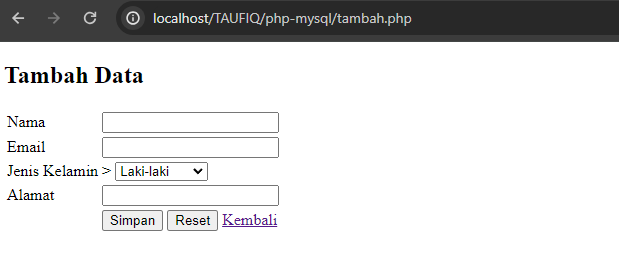
## Analisis
- `include "koneksi.php";` digunakan untuk menghubungkan ke database.
- `if(isset($_POST['nama'])){` memeriksa apakah formulir telah dikirim dengan memeriksa apakah variabel `$_POST['nama']` ada. Ini menandakan bahwa metode HTTP yang digunakan adalah `POST` dan bahwa field `nama` telah diisi.
- `$nama = $_POST['nama'];  $email = $_POST['email'];  $jenis_kelamin  = $_POST['jenis_kelamin'];  $alamat = $_POST['alamat'];` Data yang dikirim dari formulir ditangkap dan disimpan dalam variabel PHP:
    - `$nama`: Menyimpan nama siswa.
    - `$email`: Menyimpan email siswa.
    - `$jenis_kelamin`: Menyimpan jenis kelamin siswa.
    - `$alamat`: Menyimpan alamat siswa.
- `$query = mysqli_query($koneksi, "INSERT into siswa(nama,email, jenis_kelamin,
  `alamat) values ('$nama','$email','$jenis_kelamin','$alamat')");`  Bagian ini menjalankan query SQL untuk memasukkan data yang diperoleh dari formulir ke dalam tabel `siswa`.
- `if($query) {
    `echo "<script>alert('Tambah data Berhasil'); window.location.href='table.php';</script>";` Jika query berhasil (`$query` bernilai `true`): Sebuah pesan alert JavaScript ditampilkan untuk memberitahu pengguna bahwa data berhasil ditambahkan. Browser diarahkan ke halaman `table.php` menggunakan `window.location.href`.
- `}else {`
    `echo '<script>alert("Tambah data gagal")</script>';`
	`}`  Jika query gagal (`$query` bernilai `false`): Sebuah pesan alert JavaScript ditampilkan untuk memberitahu pengguna bahwa penambahan data gagal.
-  Formulir HTML dikirimkan dengan metode `post`.
- Field input untuk `nama`, `email`, `jenis_kelamin`, dan `alamat` disediakan.
- Tombol `Simpan` untuk mengirim formulir, tombol `Reset` untuk mengatur ulang formulir, dan link untuk kembali ke `table.php`.`
## Kesimpulan
Program PHP ini menangani pengiriman formulir untuk menambahkan data siswa ke database MySQL. Ini mengambil data dari formulir HTML, menjalankan query SQL `INSERT` untuk menyimpan data ke tabel `siswa`, dan memberikan umpan balik kepada pengguna tentang keberhasilan atau kegagalan operasi.

--- 
# UBAH DATA
## Program 
```php
<!DOCTYPE html>
<html lang="en">
<head>
    <title>Document</title>
</head>
<body>
    <h2>Ubah Data</h2>
    <?php
    include "koneksi.php";
    $id = $_GET['id'];

    if(isset($_POST['nama'])) {
        $nama           = $_POST['nama'];
        $email          = $_POST['email'];
        $jenis_kelamin  = $_POST['jenis_kelamin'];
        $alamat         = $_POST['alamat'];

        $query = mysqli_query($koneksi, "UPDATE siswa SET nama='$nama', email='$email', jenis_kelamin='$jenis_kelamin', alamat='$alamat' WHERE id_siswa=$id");
        if($query) {
            echo "<script>
            alert('ubah data Berhasil')
            window.location.href='table.php'
            </script>";
        }else {
            echo '<script>alert("ubah data gagal")</script>';
        }
    }
  
    $query = mysqli_query($koneksi, "SELECT*FROM siswa where id_siswa=$id");
    $data = mysqli_fetch_array($query);
    ?>
    <form method="post" >
        <table>
            <tr>
                <td>Nama</td>
                <td><input type="text" value="<?= $data['nama'] ?>" name="nama"></td>
            </tr>
            <tr>
                <td>Email</td>
               <td><input type="text" value="<?= $data['email'] ?>" name="email"></td>
            </tr>
            
            <tr>
                <td>Jenis Kelamin</td>
                <td>>
                    <select name="jenis_kelamin">
                        <option <?php if($data['jenis_kelamin'] == "laki-laki") echo 'selected'; ?>>Laki-laki</option>
                        <option <?php if($data['jenis_kelamin'] == "perempuan") echo 'selected'; ?>>Perempuan</option>
                    </select>  
                </td>
            </tr>
  
            <tr>
                <td>Alamat</td>
                <td><input type="text" value="<?= $data['alamat'] ?>" name="alamat"></td>
            </tr>
  
            <tr>
                <td></td>
                <td>
                    <button type="submit">Ubah</button>
                    <button type="reset">Reset</button>
                    <a href="table.php">Kembali</a>
                </td>
            </tr>
        </table>
    </form>
</body>
</html>
```
## Hasil
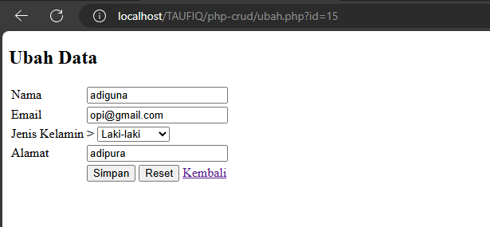

## Analisis
- `include "koneksi.php";` digunakan untuk menghubungkan ke database.
- Mengambil `id` siswa dari URL menggunakan `$_GET['id']`.
- `if(isset($_POST['nama'])){` memeriksa apakah formulir telah dikirim dengan memeriksa apakah variabel `$_POST['nama']` ada. Ini menandakan bahwa metode HTTP yang digunakan adalah `POST` dan bahwa field `nama` telah diisi.
- `$nama = $_POST['nama'];  $email = $_POST['email'];  $jenis_kelamin  = $_POST['jenis_kelamin'];  $alamat = $_POST['alamat'];` Data yang dikirim dari formulir ditangkap dan disimpan dalam variabel PHP:
    - `$nama`: Menyimpan nama siswa.
    - `$email`: Menyimpan email siswa.
    - `$jenis_kelamin`: Menyimpan jenis kelamin siswa.
    - `$alamat`: Menyimpan alamat siswa.
- `$query = mysqli_query($koneksi, "UPDATE siswa SET nama='$nama', email='$email', jenis_kelamin='$jenis_kelamin', alamat='$alamat' WHERE id_siswa=$id");` Query SQL `UPDATE` digunakan untuk memperbarui data siswa berdasarkan `id_siswa`.
- `if($query) {
    `echo "<script>alert('Ubah data Berhasil'); window.location.href='table.php';</script>";` Jika query berhasil (`$query` bernilai `true`): Sebuah pesan alert JavaScript ditampilkan untuk memberitahu pengguna bahwa data berhasil diubah. Browser diarahkan ke halaman `table.php` menggunakan `window.location.href`.
- `}else {`
    `echo '<script>alert("perubahan data gagal")</script>';`
	`}`  Jika query gagal (`$query` bernilai `false`): Sebuah pesan alert JavaScript ditampilkan untuk memberitahu pengguna bahwa perubahan data gagal.
- `$query = mysqli_query($koneksi, "SELECT * FROM siswa WHERE id_siswa=$id");` - Fungsi ini digunakan untuk menjalankan query SQL pada koneksi database yang sudah ada (`$koneksi`). Query SQL `SELECT * FROM siswa WHERE id_siswa=$id`
    - **`SELECT *`**: Mengambil semua kolom dari tabel `siswa`.
    - **`FROM siswa`**: Menentukan tabel `siswa` sebagai sumber data.
    - **`WHERE id_siswa=$id`**: Menentukan kondisi bahwa hanya baris dengan `id_siswa` yang sesuai dengan nilai `$id` yang akan diambil.
	- **Nilai `$id`**: Nilai ini berasal dari parameter URL (`$_GET['id']`) yang digunakan untuk mengidentifikasi siswa yang datanya akan diambil.
- `$data = mysqli_fetch_array($query);` - **`mysqli_fetch_array`**: Fungsi ini mengambil satu baris hasil dari query sebagai array asosiatif (dan numerik). Setiap kolom dari hasil query akan menjadi elemen dalam array yang dihasilkan.  Parameter `$query`**: Ini adalah hasil dari `mysqli_query`, yang berisi resource hasil query.
- Formulir HTML Menampilkan formulir dengan data siswa yang telah diambil, sehingga pengguna dapat mengubahnya.
- Field Input Mengisi field input dengan data siswa yang sudah ada (`$data['nama']`, `$data['email']`, `$data['jenis_kelamin']`, `$data['alamat']`).
- Jenis Kelamin Menampilkan jenis kelamin yang dipilih saat ini dengan menggunakan atribut `selected`.
## Kesimpulan
Program ini adalah halaman web untuk mengubah data siswa. Ketika halaman dimuat, data siswa yang akan diubah diambil dari database dan ditampilkan dalam formulir. Pengguna dapat mengubah data tersebut dan mengirimkan formulir untuk menyimpan perubahan ke database. Jika penyimpanan data berhasil, pengguna akan diberi tahu bahwa perubahan data berhasil dan diarahkan kembali ke halaman tabel. Jika gagal, pesan kesalahan akan ditampilkan.

---
# HAPUS DATA
## Program 
```php
<?php
include('koneksi.php');

if(isset($_GET['id'])){
    $id = $_GET['id'];
    $query = mysqli_query($koneksi, "DELETE FROM siswa WHERE id_siswa = $id");
  
   if($query) {
            echo "<script>
            alert('Hapus data Berhasil')
            window.location.href='table.php'
            </script>";
        }else {
            echo '<script>alert("Hapus data gagal")</script>';
        }
}
?>
```
## Hasil
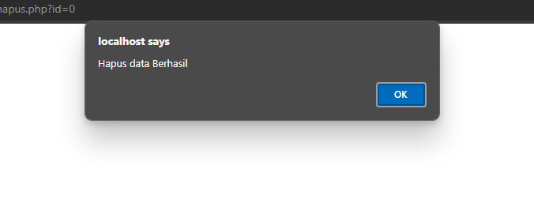
## Analisis
- `include('koneksi.php');` digunakan untuk menghubungkan ke database. Pastikan `koneksi.php` berisi koneksi yang valid ke database MySQL.
- `if(isset($_GET['id'])){` memeriksa apakah parameter `id` ada dalam URL.
- `$id = $_GET['id'];` mengambil nilai `id` dari URL.
- `mysqli_query($koneksi, "DELETE FROM siswa WHERE id_siswa = $id");` menjalankan  query untuk menghapus baris dengan `id_siswa` yang sesuai.
-  Jika query berhasil, muncul alert "Hapus data Berhasil" dan halaman dialihkan ke `table.php`.
- Jika query gagal, muncul alert "Hapus data gagal".
## Kesimpulan
Program PHP ini berfungsi untuk menghapus data siswa dari database.

---
# SESSION/LOGIN
## SESSION
### Kode Program
```PHP
<?php
session_start();

if(isset($_POST['submit'])) {
    $username = $_POST['username'];
    $password = $_POST['password'];
    $koneksi = mysqli_connect('localhost','root','','basis_data') or die ('error koneksi');
    $result = mysqli_query($koneksi,"SELECT*FROM user WHERE username = '$username' AND password ='$password'");
    $data = mysqli_fetch_array($result);
    if(isset($data)) {
        $_SESSION['username'] = $data['username'];
        $_SESSION['nama'] = $data['nama'];
        $_SESSION['status'] = 'login';
        header('location: user.php');
    }else {
        echo "Username dan Password Salah";
    }
}

?>
<!DOCTYPE html>
<html>
<head>
    <title>Login Session</title>
</head>
<body>
    <form method="post">
        <label>Username</label>
        <input type="text" name="username">
        <br><br>
        <label>Password</label>
        <input type="password" name="password">
        <br><br>
        <button type="submit" name="submit">Login</button>
    </form>
</body>
</html>
```
### Hasil
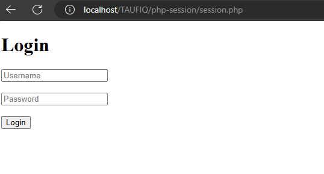
### Analisis
- `session_start();` digunakan untuk memulai sesi. Ini memungkinkan penggunaan variabel sesi untuk menyimpan data pengguna yang login.
 - `if(isset($_POST['submit'])) {` memeriksa apakah formulir login telah disubmit
    - `$username = $_POST['username'];`
    - `$password = $_POST['password'];`
    - Nilai username dan password diambil dari input formulir.
- `$koneksi = mysqli_connect('localhost','root','','basis_data') or die ('error koneksi');` menghubungkan ke database MySQL.
- `$result = mysqli_query($koneksi,"SELECT * FROM user WHERE username = '$username' AND password ='$password'");` menjalankan query untuk mencari pengguna dengan username dan password yang diberikan.
- `$data = mysqli_fetch_array($result);` mengambil data pengguna jika query berhasil.
- `if(isset($data)) {` memeriksa apakah data pengguna ditemukan.
- Jika ditemukan, menyimpan data ke sesi dan mengalihkan pengguna ke halaman `user.php`.
- Jika tidak ditemukan, menampilkan pesan "Username dan Password Salah".
- `<form method="post">` menggunakan metode POST untuk mengirim data ke server. Metode POST lebih aman dibandingkan GET untuk mengirimkan data sensitif seperti username dan password.
- `<label>Username</label>`  `<input type="text" name="username">` :  Label dan input ini digunakan untuk memasukkan username. Input tipe teks (`type="text"`) tanpa atribut tambahan apa pun.
- `<label>Password</label>`   `<input type="password" name="password">`  Label dan input ini digunakan untuk memasukkan password. Input tipe password (`type="password"`) menyembunyikan karakter yang diketik untuk keamanan.
- `<button type="submit" name="submit">Login</button>`  Tombol ini mengirimkan data form ketika ditekan.

### Kesimpulan
Kode PHP dan HTML ini berfungsi sebagai sistem login dasar yang memungkinkan pengguna untuk masuk dengan username dan password.

---
## USER
### Kode Program
```PHP
<?php
session_start();
if ($_SESSION['status'] == 'login' && $_SESSION['username'] == 'admin') {
    header("Location: admin.php");
}
if ($_SESSION['status'] != 'login') {
    header('Location: session.php');
}
?>
<!DOCTYPE html>
<html lang="en">
<head>
    <title>Document</title>
</head>
<body>
    <h1>Halaman User</h1>
    <h1>Halo, <?= $_SESSION['nama'] ?></h1>
    <a href="logout.php">Logout</a>
</body>
</html>
```
### Hasil
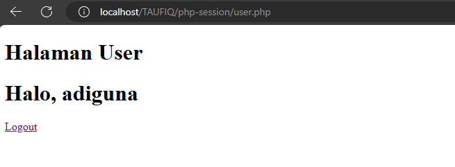
### Analisis
- `session_start();` digunakan untuk memulai sesi dan memungkinkan penggunaan variabel sesi.
- `if ($_SESSION['status'] == 'login' && $_SESSION['username'] == 'admin') { header("Location: admin.php"); }`
- Jika sesi status adalah 'login' dan username adalah 'admin', pengguna akan diarahkan ke halaman `admin.php`.
- `if ($_SESSION['status'] != 'login') { header('Location: session.php'); }`
- Jika sesi status bukan 'login', pengguna akan diarahkan ke halaman `session.php`.
- Judul halaman: `<h1>Halaman User</h1>`.
- Menampilkan sapaan menggunakan nama dari sesi: `<h1>Halo, <?= $_SESSION['nama'] ?></h1>`.
- Link untuk logout: `<a href="logout.php">Logout</a>`.

### Kesimpulan
Program ini memeriksa apakah pengguna telah login dan apakah mereka adalah admin. Jika pengguna adalah admin, mereka akan diarahkan ke halaman `admin.php`. Jika pengguna belum login, mereka akan diarahkan ke halaman `session.php`. Jika pengguna login bukan admin, mereka akan tetap di halaman ini (`user.php`).

---
## ADMIN
### Kode Program
```PHP
<?php
session_start();

if($_SESSION['status'] == 'login' && $_SESSION['username'] != 'admin') {
    header("Location: user.php");
} 

if($_SESSION['status'] != 'login') {
    header('Location: session.php');
}
?>

<!DOCTYPE html>
<html lang="en">
<head>
    <title>Document</title>
</head>
<body>
    <h1>Halaman Admin</h1>
    <h1>halo, <?=$_SESSION['nama']?></h1>
    <a href="logout.php">LOGOUT</a>
</body>
</html>
```
### Hasil
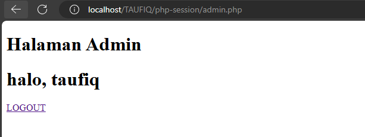

### Analisis
- `session_start();` digunakan untuk memulai sesi.    
- `if($_SESSION['status'] == 'login' && $_SESSION['username'] != 'admin') { header("Location: user.php"); }`  Jika status login adalah 'login' dan username bukan 'admin', pengguna akan diarahkan ke halaman `user.php`.
- `if($_SESSION['status'] != 'login') { header('Location: session.php'); }` Jika status login bukan 'login', pengguna akan diarahkan ke halaman `session.php`.    
- Judul halaman: `<h1>Halaman Admin</h1>`.
- Menampilkan sapaan menggunakan nama dari sesi: `<h1>halo, <?=$_SESSION['nama']?></h1>`.
- Link untuk logout: `<a href="logout.php">LOGOUT</a>`.
### Kesimpulan
Program PHP ini mengarahkan pengguna ke halaman admin jika mereka adalah admin dan telah login, dan ke halaman user.php jika mereka adalah pengguna biasa yang telah login. Jika pengguna belum login, mereka diarahkan ke halaman session.php. Halaman admin menampilkan sapaan dengan nama pengguna yang diambil dari sesi.

---
## CEK_USER
### Kode Program
```PHP
<?php
if($_SESSION['status'] == 'login' && $_SESSION['username'] != 'admin') {
    header("Location: user.php");
}else if($_SESSION['status'] == 'login' && $_SESSION['username'] == 'admin') {
    header("Location: admin.php");
}else {
    header("Location: session.php");
}
```
### Hasil
#### USER


#### ADMIN 


### Analisis
- `if($_SESSION['status'] == 'login' && $_SESSION['username'] != 'admin') {header("Location: user.php");` Jika pengguna sudah login dan bukan admin, mereka akan diarahkan ke halaman `user.php`.
- `else if($_SESSION['status'] == 'login' && $_SESSION['username'] == 'admin') {header("Location: admin.php");`  Jika pengguna sudah login dan adalah admin, mereka akan diarahkan ke halaman `admin.php`.
- `else { header("Location: session.php");}` Jika pengguna belum login, mereka akan diarahkan ke halaman `session.php`.
### Kesimpulan
Program ini mengarahkan pengguna ke halaman yang sesuai berdasarkan status login dan peran pengguna (admin atau bukan admin).

---
## LOGOUT
### Kode Program
```PHP
<?php
session_start();
session_destroy();
session_unset();

header('location: session.php');
?>
```
### Hasil


### Analisis
- `session_start();` digunakan untuk memulai sesi.
- `session_destroy();` menghapus semua data yang terkait dengan sesi yang sedang berjalan.
- `session_unset();` menghapus semua variabel sesi.    
- `header('location: session.php');` digunakan untuk mengarahkan pengguna kembali ke halaman `session.php` setelah sesi dihancurkan.
### Kesimpulan
 Program ini berfungsi untuk keluar dari sesi pengguna dan mengarahkannya kembali ke halaman login (`session.php`).

---
# UPLOAD & DOWNLOAD
## Download
### Kode Program
```php
<?php
include "koneksi.php";
$query = mysqli_query($koneksi, 'SELECT * FROM siswa');
  
$data = [];
$data[] = ["ID","Nama", "Email","Jenis Kelamin","Alamat"];
while ($row = mysqli_fetch_assoc($query)) {
    $data[] = [
        $row['id_siswa'],
        $row['nama'],
        $row['email'],
        $row['jenis_kelamin'],
        $row['alamat']
    ];
}

$namafile = "excel_data.xls";
header("Content-Type: application/vnd.ms-excel");
header("Content-Disposition: attachment;filename=\"$namafile\"");
header("Cache-Control: max-age=0");
$output = fopen("php://output", "w");
foreach ($data as $row) {
    fputcsv($output, $row, "\t");
}

fclose($output);
exit;
```
### Hasil
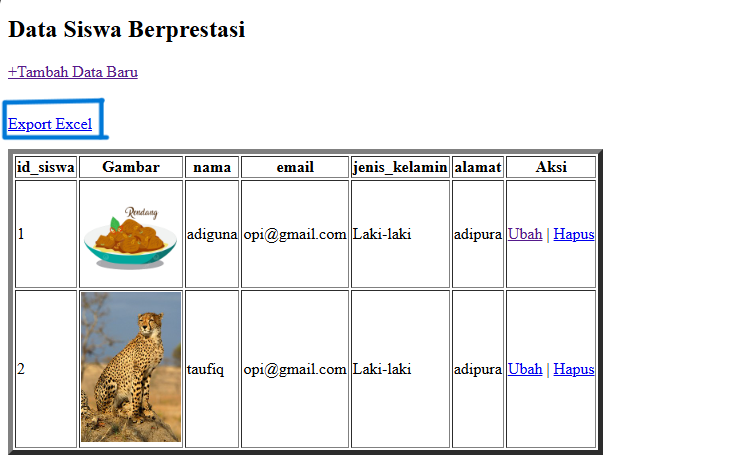
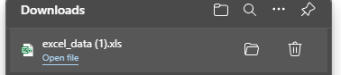
### Analisis
- `include "koneksi.php";` menyertakan file koneksi ke database.
- `$query = mysqli_query($koneksi, 'SELECT * FROM siswa');` menjalankan query untuk mengambil semua data dari tabel `siswa`.
- `$data = [];` mendeklarasikan array kosong untuk menyimpan data. 
- `$data[] = ["ID","Nama", "Email","Jenis Kelamin","Alamat"];` menambahkan header kolom ke array data.
- `while ($row = mysqli_fetch_assoc($query)) { ... }` loop untuk mengambil setiap baris hasil query dan menambahkannya ke array data.
- `$namafile = "excel_data.xls";` mendefinisikan nama file yang akan dihasilkan.
- `header("Content-Type: application/vnd.ms-excel");` mengatur tipe konten header HTTP untuk file Excel.
- `header("Content-Disposition: attachment;filename=\"$namafile\"");` mengatur header HTTP agar file dapat diunduh dengan nama yang ditentukan.
- `header("Cache-Control: max-age=0");` mengatur cache control header.
- `$output = fopen("php://output", "w");` membuka aliran keluaran standar untuk menulis data.
- `foreach ($data as $row) { fputcsv($output, $row, "\t"); }` menulis setiap baris data ke output dalam format CSV dengan delimiter tab (`"\t"`).
- `fclose($output);` menutup aliran keluaran.
- `exit;` menghentikan eksekusi skrip setelah file selesai ditulis.
### Kesimpulan
Program PHP ini mengambil data dari tabel `siswa` di database dan mengekspornya ke file Excel bernama `excel_data.xls`.

---
## Upload 
### Kode Program 
```php
<!DOCTYPE html>
<html lang="en">
<head>
    <title>Tambah Data</title>
</head>
<body>
    <h2>Tambah Data</h2>
    <?php
    include "koneksi.php";
  
    function upload(): string
{
    $nameImage = $_FILES['gambar']['name'];
    $directoryFile = $_FILES['gambar']['tmp_name'];
    $errorImage = intval($_FILES['gambar']['error']);
    $sizeFile = $_FILES['gambar']['size'];

    // cek apakah gambar ada
    if ($errorImage === 4) {
        echo "<script>alert('Anda Belum Upload Gambar')</script>";
        return false;
    }

    // mengambil ekstensi file
    $validType = ['svg', 'jpg', 'png', 'jpeg', 'webp'];
    $extensionFile = explode(".", $nameImage);
    $extensionValid = strtolower(end($extensionFile));

    // cek apakah yang diupload gambar atau bukan
    if (!in_array($extensionValid, $validType)) {
        echo "<script>alert('yang anda Upload bukan gambar')</script>";
        return false;
    }
  
    // cek size file
    if ($sizeFile > 3_000_000) {
        echo "<script>alert('Ukuran File Terlalu Besar!!(Maks 3MB)')</script>";
        return false;
    }
    
    // upload file
    $nameImage = uniqid() . "." . $extensionValid;
    move_uploaded_file($directoryFile, "img/{$nameImage}");
    // mengembalikan namafile yg sudah divalidasi
    return $nameImage;
}

    if(isset($_POST['simpan'])){
        $nama                    = $_POST['nama'];
        $email                   = $_POST['email'];
        $jenis_kelamin           = $_POST['jenis_kelamin'];
        $alamat                  = $_POST['alamat'];
        $gambar                  = upload();
        if (!$gambar) {
            return false;
        }

        $query = mysqli_query($koneksi, "INSERT into siswa(nama,email,jenis_kelamin,alamat,gambar) values ('$nama','$email','$jenis_kelamin','$alamat','$gambar')");
        if($query) {
            echo "<script>
            alert('Tambah data Berhasil')
            window.location.href='table.php'
            </script>";
        }else {
            echo '<script>alert("Tambah data gagal")</script>';
        }
    }
    ?>
    <form method="post"  enctype="multipart/form-data" >
        <table>
            <tr>
                <td>Nama</td>
                <td><input type="text" name="nama"></td>
            </tr>
            <tr>
                <td>email</td>
                <td><input type="email" name="email"></td>
            </tr>
            <tr>
                <td>Jenis Kelamin</td>
                <td>>
                    <select name="jenis_kelamin">
                        <option>Laki-Laki</option>
                        <option>Perempuan</option>
                    </select>  
                </td>
            </tr>
            <tr>
                <td>Alamat</td>
                <td><input type="text" name="alamat"></td>
            </tr>
            <tr>
                <td>gambar</td>
                <td><input type="file" name="gambar"></td>
            </tr>
            <tr>
                <td></td>
                <td>
                    <button name="simpan" type="submit">Simpan</button>
                    <button type="reset">Reset</button>
                    <a href="index.php">Kembali</a>
                </td>
            </tr>
        </table>
    </form>
</body>
</html>
```
## Hasil
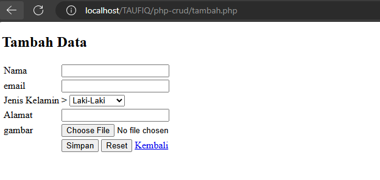

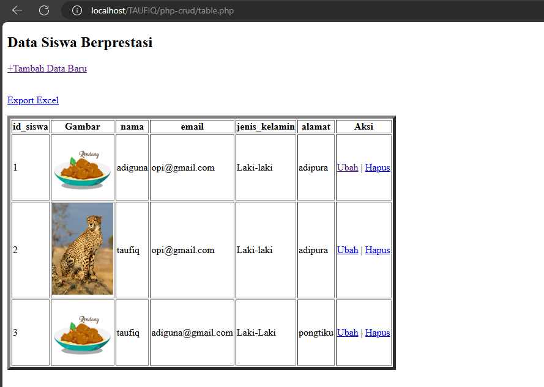

## Analisis
- Memasukkan file `koneksi.php` untuk menyertakan koneksi database.
- Deklarasi Fungsi Upload: Fungsi upload menangani proses upload file gambar dengan beberapa langkah validasi.
- Cek Keberadaan Gambar: Mengecek apakah gambar sudah di-upload.
- Ekstensi File: Mengecek apakah file yang di-upload memiliki ekstensi yang valid `(svg, jpg, png, jpeg, webp).`
- Ukuran File: Mengecek apakah ukuran file tidak melebihi 3MB.
- Proses Upload: Jika semua validasi berhasil, file akan dipindahkan ke direktori `img` dengan nama unik.
- Mengecek Submit: Mengecek apakah tombol "Simpan" diklik.
- Mengambil Data dari Form: Mengambil data dari form (nama, email, jenis kelamin, alamat).
- Memanggil Fungsi Upload: Memanggil fungsi upload untuk mengupload gambar. Jika upload gagal, proses akan berhenti.o
- Insert Data ke Database: Menjalankan query `INSERT` untuk menambahkan data ke tabel siswa di database.
- Notifikasi dan Redirect: Menampilkan notifikasi menggunakan JavaScript dan mengarahkan pengguna ke halaman `table.php` jika berhasil, atau menampilkan pesan kesalahan jika gagal.
- Atribut `enctype`: Mengatur `enctype` ke `multipart/form-data` untuk mengizinkan upload file.
- Input Fields: Mengandung input untuk nama, email, jenis kelamin, alamat, dan gambar.
- Buttons: Tombol untuk menyimpan, mereset form, dan link kembali ke halaman `table.php`.
## Kesimpulan
Program PHP tersebut adalah formulir tambah data siswa dengan fitur validasi dan pengunggahan gambar.

---