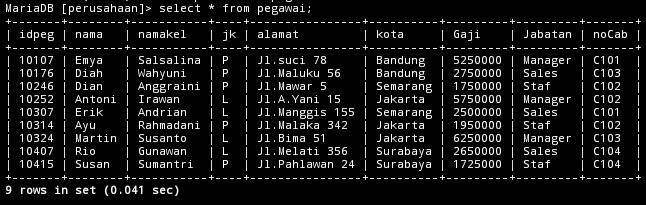
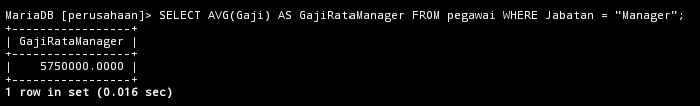
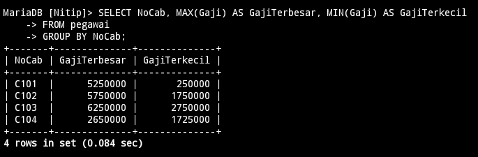

---
# Tabel Pegawai 


# 8
## Query
```mysql
SELECT noCab, SUM(Gaji) AS Total_Gaji from pegawai GROUP BY noCab HAVING SUM(Gaji) >= 8000000;
```
## Hasil

## Analisis
==select== = untuk memilih kolom mana saja yang dipilih untuk di tampilkan atau di jumlah.
==noCab== = nama kolom yang dipilih untuk ditampilkan.
==SUM(Gaji)== = untuk menghitung jumlah data (Khusus Angka) pada kolom yang dipilih.``Gaji`` adalah nama kolom yang dipilih untuk dijumlahkan isi datanya.
==AS== = untuk mengganti nama dari SUM(Gaji) untuk sementara.
==Total Gaji== = adalah nama sementara dari perintah ``AS``.
==From Pegawai== = untuk memilih dari tabel mana yang data kolomnya akan di gunakan, ``Pegawai`` Adalah Nama Tabel Yang akan di pilih.
==GROUP BY== = untuk mengelompokkan data berdasarkan nilai data Yang telah ditentukan Pada kolom yang dipilih.
==Nocab== = nama kolom Yang dipilih untuk datanya dikelompokkan.
==Having== = kondisi yang harus dipenuhi oleh suatu kelompok data agar bisa ditampilkan. 
==(Sum (Gaji) >= 800000)== = kondisi dari HAVING, Hasil dari Penjumlahan Gai yang hanya bisa ditampilkan adalah Hasil yang lebih dari atau sama dengan 8000000.
==Hasilnya== = Sama seperti sebelumnya, tetapi Nocab Yang memenuhi kondisi tersebut hanyalah C102 dan C103 karena hasil Jumlah kolom Gaji nya lebih dari atau sama dengan 8000000. Adapun hasil kolom Sum(Gaji) diganti Jadi Total-Gaji.

___
# 9
## Query

```mysql
SELECT AVG(Gaji) AS rata_rata from pegawai;
```
## Hasil

## Analisis
==Select== = untuk memilih kolom mana data Yang dipilih untuk ditampilkan.
==AVG (Gaji)== = untuk menghitung rata-rata dari data yang ada Pada kolom Yang dipilih. 
Gaji adalah nama kolom Yang dipilih untuk dihitung rata-ratanya.
==As== = untuk mengganti nama dari kolom hasil AVG (Gaji) untuk sementara.
==Rata-rata== =nama sementara dari Perintah AS.
==From Pegawai== = untuk memilih dari tabel mana Yang data kolomnya ingin digunakan
==Pegawai== = adalah nama dari tabel yang dipilih.
==Hasilnya== = 3397222.2222 merupakan hasil rata-rata dari semua 9 barisan data Pada kolom Gaji. Adapun nama kolom hasil dari AVG (Gaji) Yaitu Rata-rata

___
# 10
## Query
```Mysql
SELECT AVG(Gaji) AS GajiRataManager FROM pegawai WHERE Jabatan = "Manager";
```
## Hasil

## Analisis
==SELECT== = untuk memilih kolom mana saja yang dipilih untuk ditampilkan.
==AVG (Gaji)== = untuk menghitung rata-rata dari data yang ada pada kolom Yang dipilih. Gaji adalah nama kolom Yang dipilih untuk dihitung rata-ratanya.
==AS== = untuk mengganti nama dari kolom hasil AVG (Gaji) untuk sementara.
==GajiRataManager== = nama sementara dari Perintah AS.
==FROM pegawai== = untuk memilih dari tabel mana Yang data kolomnya ingin Pegawai adalah nama dari tabel Yang diingin digunakan.
==WHERE== = Kondisi yang harus dipenuhi oleh suatu kolom agar datanya bisa dihitung rata-ratanya
==(Jabatan = 'Manajer')== = kondisi dari WHERE. Barisan data yang kolom Jabatannya Manajer akan dihitung rata-rata kolom Gaji nya.
==Hasilnya== = 5750000.0000 merupakan hasil hitung rata-rata dari barisan data yang memiliki manajer di kolom Jabatan nya,dari situ kolom Gajinya di hitung.

---
# Tabel Pegawai 


# 11
## Query 
```mysql
SELECT nocab, AVG(gaji) AS ratagaji FROM pegawai GROUP BY nocab;
```
## Hasil


## Analisis 
- `SELECT` untuk memilih kolom mana saja yang dipilih untuk ditampilkan/dihitung.
- `nocab` kolom yang dipilih untuk ditampilkan.
- `AVG(gaji)` untuk menghitung rata-rata dari data yang ada pada kolom yang dipilih. `gaji` adalah nama kolom yang dipilih untuk dihitung rata-ratanya.
- `AS` untuk mengganti nama dari kolom hasil `AVG(gaji)` untuk sementara.
- `RataGaji` adalah nama sementara dari perintah `AS`.
- `FROM pegawai` untuk memilih dari tabel mana yang data kolomnya ingin digunakan. Pegawai adalah nama dari tabel yang dipilih.
- `GROUP BY` untuk mengelompokkan data berdasarkan nilai data yang telah ditentukan pada kolom yang dipilih.
- `nocab` nama kolom yang dipilih untuk datanya dikelompokkan.
- hasilnya hampir sama seperti no.7 masing-masing kolom nocab dihitung rata-ratanya. Sesuai dengan isi nocab,jadi yang `C101` dihitung dengan `C101` yang lainnya juga (yang sama) adapun ratagaji merupakan nama sementara dari kolom hasil `AVG(gaji)`.

---
# 12
## Query 
```mysql
SELECT nocab, AVG(gaji) AS Ratagaji FROM pegawai GROUP BY nocab HAVING nocab = 'C101' OR nocab = 'C102';
```
## Hasil


## Analisis 
- `SELECT` untuk memilih kolom mana saja yang dipilih untuk ditampilkan/dihitung.
- `nocab` kolom yang dipilih untuk ditampilkan.
- `AVG(gaji)` untuk menghitung rata-rata dari data yang ada pada kolom yang dipilih. `gaji` adalah nama kolom yang dipilih untuk dihitung rata-ratanya.
- `AS` untuk mengganti nama dari kolom hasil `AVG(gaji)` untuk sementara.
- `RataGaji` adalah nama sementara dari perintah `AS`.
- `FROM pegawai` untuk memilih dari tabel mana yang data kolomnya ingin digunakan. Pegawai adalah nama dari tabel yang dipilih.
- `GROUP BY` untuk mengelompokkan data berdasarkan nilai data yang telah ditentukan pada kolom yang dipilih.
- `nocab` nama kolom yang dipilih untuk datanya dikelompokkan.
- `HAVING` kondisi yang harus dipenuhi oleh suatu kelompok data.
- `nocab = 'C101' OR nocab = 'C102'` merupakan kondisi dari HAVING. Jadi kolom nocab yang memiliki C101 atau C102 yang hanya akan ditampilkan OR adalah kondisi yang hanya salah satu datanya yang harus dipenuhi.

---
# 13
## Query 
```mysql
SELECT MAX(gaji) AS gajiterbesar, MIN(gaji) AS gajiterkecil FROM pegawai;
```
## Hasil


## Analisis 
- `SELECT` untuk memilih kolom mana saja yang dipilih untuk ditampilkan/dihitung.
- `MAX(gaji)` untuk menampilkan nilai maksimum atau terbesar/tertinggi dari suatu data dalam kolom yang dipilih. Gaji adalah nama kolom yang dipilih.
- `AS gajiterbesar` untuk mengganti nama dari kolom hasil MAX(gaji) menjadi nama sementaranya yaitu gajiterbesar.
- `MIN(gaji)` untuk menampilkan nilai minimum atau terkecil/terendah dari suatu data dalam kolom yang dipilih. gaji adalah nama kolom yang dipilih.
- `AS gajiterkecil` untuk mengganti nama dari kolom hasil MIN(gaji) menjadi gajiterkecil untuk sementara.
- `FROM pegawai` untuk memilih dari tabel mana yang data kolomnya ingin digunakan. Pegawai adalah nama dari tabel yang dipilih.
- `hasilnya` jadi dari 9 nilai yang ada di kolom gaji,gaji maksimumnya adalah `6250000` dan namanya diubah menjadi gajiterbesar, bagi minimunnya adalah `1725000` dan namanya diubah menjadi gajiterkecil.

---
# 14
## Query
```sql
SELECT MAX(Gaji) AS GajiTerbesar, MIN(Gaji) AS GajiTerkecil
FROM pegawai
WHERE Jabatan = "Manajer";
```
## Hasil

## Analisis
- `SELECT`= Untuk memilih kolom nama mana saja yang dipilih untuk ditampilkan l.
- `MAX(Gaji)`= Untuk menampilkan nilai terbesar dari suatu data dalam kolom yang dipilih. Gaji  adalah nama kolom yang dipilih.
- `AS GajiTerbesar`= Untuk Menganti nama dari kolom hasil `MAX(Gaji)` menjadi `GajiTerbesar` untuk sementara.
- `MIN(Gaji)`= Untuk menampilkan nilai terkecil dari suatu data dalam kolom yang dipilih. Gaji adalah nama kolom yang dipilih.
- `AS GajiTerkecil`= Untuk Menganti nama dari kolom hasil `MIN(Gaji)` menjadi `GajiTerkecil` untuk sementara.
- `FROM pegawai`= Untuk memilih dari tabel mana yang data kolomnya ingin ditampilkan.
- `WHERE`= Kondisi yang harus dipenuhi oleh suatu kolom data agar bisa ditampilkan.
- `(Jabatan = "Manajer")`= Kondisi dari `WHERE` yang harus dipenuhi. Barisan data yang kolom jabatannya berisi manajer akan ditampilkan kolom Gajinya.
- **Hasilnya** = Jabatan Manajer yang memiliki nilai maksimum adalah 6250000 kolom hasil `MAX`nya diubah jadi `GajiTerbesar`.  
  Sedangkan nilai minimumnya adalah 5250000 kolom hasil `MIN`nya diubah jadi `GajiTerkecil`
---
# 15
## Query
```sql
SELECT NoCab, MAX(Gaji) AS GajiTerbesar, MIN(Gaji) AS GajiTerkecil
FROM pegawai
GROUP BY NoCab;
```
## Hasil

## Analisis
- `SELECT`= Untuk memilih kolom nama mana saja yang dipilih untuk ditampilkan.
- `NoCab`= Nama kolom yang ingin ditampilkan.
- `MAX(Gaji)`= Untuk menampilkan nilai terbesar dari suatu data dalam kolom yang dipilih. Gaji  adalah nama kolom yang dipilih.
- `AS GajiTerbesar`= Untuk Menganti nama dari kolom hasil `MAX(Gaji)` menjadi `GajiTerbesar` untuk sementara.
- `MIN(Gaji)`= Untuk menampilkan nilai terkecil dari suatu data dalam kolom yang dipilih. Gaji adalah nama kolom yang dipilih.
- `AS GajiTerkecil`= Untuk Menganti nama dari kolom hasil `MIN(Gaji)` menjadi `GajiTerkecil` untuk sementara.
- `FROM pegawai`= Untuk memilih dari tabel mana yang data kolomnya ingin ditampilkan.
- `GROUP BY`= Untuk mengelompokkan data berdasarkan nilai data yang telah ditentukan pada kolom yang dipilih.
- `NoCab`= Nama kolom yang ingin dikelompokkan.
- **Hasilnya** = Masing-masing `NoCab` dicari nilai maksimum dan minimumnya. Mulai dari C101,C102,,C103,C104 dan nama hasil kolomnya diubah menjadi `GajiTerbesar` dan `GajiTerkecil`.
---
# 16
## Query
```sql
SELECT NoCab, MAX(Gaji) AS GajiTerbesar, MIN(Gaji) AS GajiTerkecil
FROM pegawai
GROUP BY NoCab HAVING COUNT(NIP) >= 3;
```
## Hasil

## Analisis
- `SELECT`= Untuk memilih kolom nama mana saja yang dipilih untuk ditampilkan.
- `NoCab`= Nama kolom yang ingin ditampilkan.
- `MAX(Gaji)`= Untuk menampilkan nilai terbesar dari suatu data dalam kolom yang dipilih. Gaji  adalah nama kolom yang dipilih.
- `AS GajiTerbesar`= Untuk Menganti nama dari kolom hasil `MAX(Gaji)` menjadi `GajiTerbesar` untuk sementara.
- `MIN(Gaji)`= Untuk menampilkan nilai terkecil dari suatu data dalam kolom yang dipilih. Gaji adalah nama kolom yang dipilih.
- `AS GajiTerkecil`= Untuk Menganti nama dari kolom hasil `MIN(Gaji)` menjadi `GajiTerkecil` untuk sementara.
- `FROM pegawai`= Untuk memilih dari tabel mana yang data kolomnya ingin ditampilkan.
- `GROUP BY`= Untuk mengelompokkan data berdasarkan nilai data yang telah ditentukan pada kolom yang dipilih.
- `NoCab`= Nama kolom yang ingin dikelompokkan.
- `HAVING`= Kondisi yang harus dipenuhi oleh suatu kelompok data.
- `(COUNT(NIP) >= 3`= Kondisi dari `HAVING` hanya hasil hitung kolom `NIP` yang lebih dari atau sama dengan 3 yang muncul.
- **Hasilnya** = Seperti no.4, yang mempunyai hasil hitung lebih dari atau sama dengan 3 adalah `NoCab C102`. Jadi hanya itu yang dicari nilai maksimum dan minimumnya pada kolom `Gaji`.

---