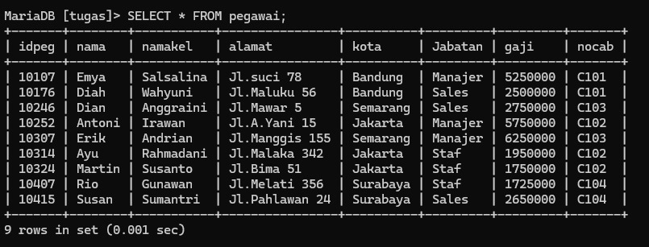

# Tabel Pegawai 

# 11
## Query 

## Analisis 
- `SELECT` untuk memilih kolom mana saja yang dipilih untuk ditampilkan/dihitung.
- `nocab` kolom yang dipilih untuk ditampilkan.
- `AVG(gaji)` untuk menghitung rata-rata dari data yang ada pada kolom yang dipilih. `gaji` adalah nama kolom yang dipilih untuk dihitung rata-ratanya.
- `AS` untuk mengganti nama dari kolom hasil `AVG(gaji)` untuk sementara.
- `RataGaji` adalah nama sementara dari perintah `AS`.
- `FROM pegawai` untuk memilih dari tabel mana yang data kolomnya ingin digunakan. Pegawai adalah nama dari tabel yang dipilih.
- `GROUP BY` untuk mengelompokkan data berdasarkan nilai data yang telah ditentukan pada kolom yang dipilih.
- `nocab` nama kolom yang dipilih untuk datanya dikelompokkan.
- hasilnya hampir sama seperti no.7 masing-masing kolom nocab dihitung rata-ratanya.

## Hasil
